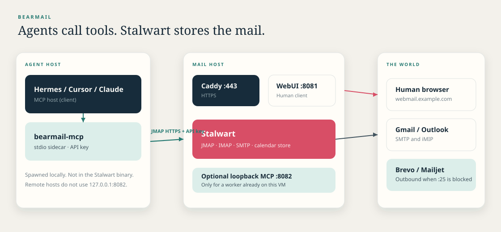
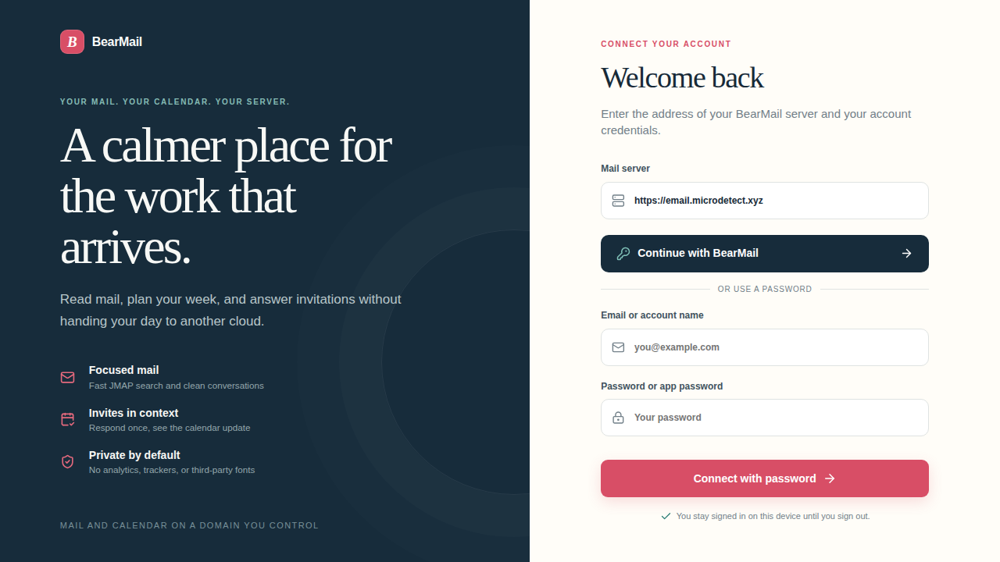
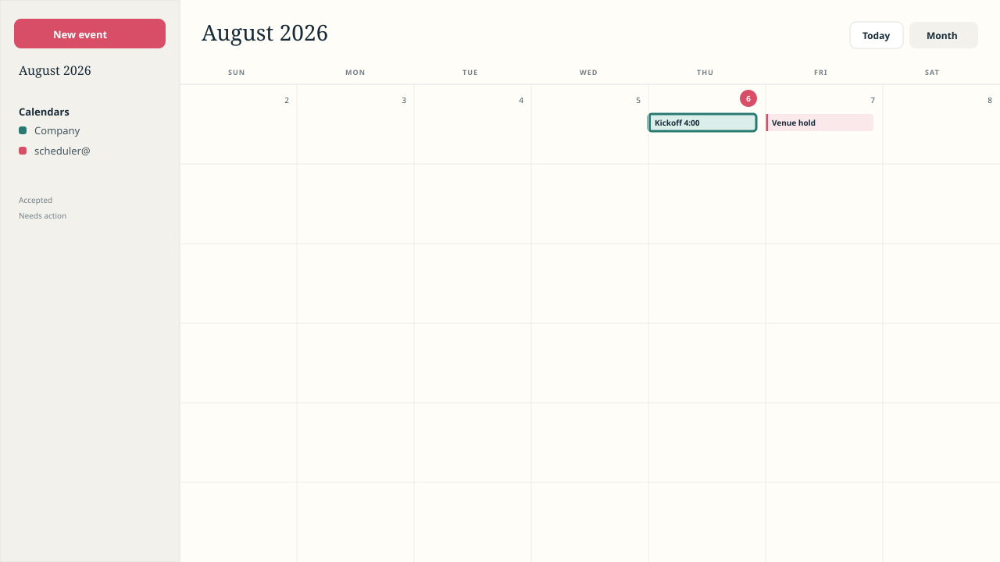

# BearMail

Give every AI agent a **real, scoped mailbox and calendar on your company
domain**. Self-hosted control. Ordinary email and calendar to the rest of
the world. Draft first; send only when you allow it.

BearMail is **not** a Gmail replacement and **not** a managed suite. It is
an opinionated install of [Stalwart](https://stalw.art) plus a WebUI and an
MCP sidecar so Cursor, Claude, or Hermes can use the same JMAP store humans
see in the browser.

**5-minute path:** [docs/QUICKSTART.md](docs/QUICKSTART.md).
**Prerequisites and limits:** [docs/LIMITATIONS.md](docs/LIMITATIONS.md).
**Release:** [v0.1.0](https://github.com/luoxiprovo/bearmail/releases/tag/v0.1.0) — Linux x86-64 binary, WebUI archive, checksums.

One Linux **x86-64** / systemd server, one interactive installer. When it
finishes you have:

- mail on `mail.example.com` (SMTP, IMAP, JMAP, admin);
- webmail and calendar on `https://webmail.example.com`;
- HTTPS via Caddy;
- outbound through Brevo (Mailjet optional) when the VPS blocks TCP 25;
- DNS through **name.com** (other registrars are manual).



Larger diagram: [docs/ARCHITECTURE.md](docs/ARCHITECTURE.md).

### Screenshots

| Connect | Mail | Calendar |
| --- | --- | --- |
| [](docs/img/screenshot-connect.png) | [](docs/img/screenshot-mail.svg) | [](docs/img/screenshot-calendar.svg) |

Connect is a live WebUI capture. Mail and calendar show the same client.

### This release does not include

Managed hosting, Google/Microsoft suite parity, Docker/Kubernetes, ARM,
generic one-click catalogues, an SLA, compliance certifications, or
autonomous send from day one. MCP is Draft v0.1.

## Quick Install

On a Linux **x86-64** server with systemd, from an SSH session:

```sh
curl -fsSL https://raw.githubusercontent.com/luoxiprovo/bearmail/main/release_install.sh | sudo bash
```

That downloads `install.sh`, the `stalwart` binary, and
`stalwart-webui.tar.gz` from this GitHub repo, then starts the interactive
setup. Prepare the [name.com](#1-namecom-domain-and-account) and
[SMTP relay](#2-smtp-relay-account-brevo-recommended) accounts first. The
wizard will ask for them.

Preview the download plan without changing the system:

```sh
curl -fsSL https://raw.githubusercontent.com/luoxiprovo/bearmail/main/release_install.sh | sh -s -- --dry-run
```

### 1 GB VMs (e2-micro)

After a successful install on a small host (~1 GB RAM), cap RocksDB, add 2 GB
swap, and apply OS memory limits:

```sh
curl -fsSL https://raw.githubusercontent.com/luoxiprovo/bearmail/main/small-memory-optimize.sh | sudo bash
```

Preview with `sudo bash -s -- --dry-run`. Details:
[Small-memory VMs](docs/INSTALL.md#small-memory-vms).

### AI agents (MCP)

On a server that already has BearMail, add the MCP sidecar. This does not
replace Stalwart, Caddy, DNS, or stored mail:

```sh
curl -fsSL https://raw.githubusercontent.com/luoxiprovo/bearmail/main/mcp_install.sh | sudo bash
```

Preview with `sudo bash -s -- --dry-run`. If the mail origin cannot be detected:

```sh
curl -fsSL https://raw.githubusercontent.com/luoxiprovo/bearmail/main/mcp_install.sh | sudo bash -s -- --server-url https://mail.example.com
```

Then create a **dedicated** mailbox (not the founder inbox), issue a
**Stalwart API key** (`API_…`), and paste this into the MCP host. Leave
`draft-only` on until you opt in. Do not use a human password or `app_…`.

```json
{
  "mcpServers": {
    "bearmail": {
      "command": "node",
      "args": ["/opt/bearmail-mcp/dist/stdio.js"],
      "env": {
        "BEARMAIL_SERVER": "https://mail.example.com",
        "BEARMAIL_USERNAME": "scheduler@example.com",
        "BEARMAIL_TOKEN": "API_<stalwart-api-key>",
        "BEARMAIL_SEND_MODE": "draft-only"
      }
    }
  }
}
```

Guide: [How an AI agent uses BearMail](docs/AGENT_GUIDE.md).
Copy-paste configs: [`mcp/mcp.json.example`](mcp/mcp.json.example) (Cursor),
[`mcp/claude_desktop.json.example`](mcp/claude_desktop.json.example),
[`mcp/hermes.json.example`](mcp/hermes.json.example).

### Upgrade (keep config)

On a host that already has BearMail, replace the Stalwart binary, WebUI, and
MCP sidecar. This does not change `config.json`, Caddy, DNS, CORS, the SMTP
relay, or stored mail, and it does not ask setup questions:

```sh
curl -fsSL https://raw.githubusercontent.com/luoxiprovo/bearmail/main/upgrade.sh | sudo bash
```

Preview with `sudo bash -s -- --dry-run`. Do not rerun `install.sh` for this
update: that wizard re-asks CORS, relay, and DNS. After it finishes,
hard-refresh webmail so the browser loads the new assets.

## Prepare these first

Do this **before** you run the installer. The script will ask for the values;
it does not create the vendor accounts for you.

### 1. name.com domain and account

1. Buy or transfer a domain at [name.com](https://www.name.com/).
2. Keep the domain on **name.com nameservers**.
3. Sign in and open **Account Settings → API Tokens**.
4. Create a **production** API token. Two-step verification must allow API
   access.
5. Keep the **account username** and the **token** ready. The installer types
   the token with echo off and does not save it in `installer-state.json`.

You will also choose two hostnames in that zone, typically:

| Hostname | Role |
| --- | --- |
| `mail.example.com` | Mail server, admin, MX, IMAP/SMTP |
| `webmail.example.com` | BearMail web app |

They may share one public IP. They cannot be the same name.

### 2. SMTP relay account (Brevo recommended)

Cloud VMs (including Google Cloud) usually **block outbound TCP 25**. The
installer asks which relay to use. **Brevo is the default.** Mailjet remains
available.

#### Brevo (default)

1. Create an account at [app.brevo.com](https://app.brevo.com/).
2. **Settings → Senders, domains & dedicated IPs** → add your mail domain
   (the part after `@`, such as `example.com`).
3. Publish Brevo’s domain-ownership TXT (Brevo code) and DKIM as shown there.
   The installer can merge `include:spf.brevo.com` into SPF when it publishes
   DNS through name.com. Add Brevo’s DKIM selector from the dashboard yourself.
4. **Settings → SMTP & API → SMTP**
   ([SMTP page](https://app.brevo.com/settings/keys/smtp)).
5. Copy the **SMTP login** (username, often `xxx@smtp-brevo.com`) and the
   **SMTP key** (password). These are not your Brevo website password, and
   not a REST API key.

Host is `smtp-relay.brevo.com`. Port `587` (STARTTLS) is the default; `465`
is implicit TLS. See [Brevo SMTP relay](docs/BREVO_SMTP_RELAY.md).

#### Mailjet (alternative)

1. Create an account at [app.mailjet.com](https://app.mailjet.com/).
2. **Account settings → Senders & Domains** → add your mail domain.
3. Publish Mailjet’s domain-ownership TXT and DKIM. The installer can merge
   `include:spf.mailjet.com` into SPF when it publishes DNS through name.com.
4. **Account settings → SMTP and SEND API settings**
   ([relay page](https://app.mailjet.com/account/relay)).
5. Copy the **API key** (SMTP username) and **secret key** (SMTP password).

Host is `in-v3.mailjet.com`. See [Mailjet SMTP relay](docs/MAILJET_SMTP_RELAY.md).

### 3. A Linux server

- Linux **x86-64** with systemd, root (`sudo`), and an interactive terminal (SSH is
  fine).
- A public IPv4 address (IPv6 optional).
- Inbound TCP **80** and **443** open if you use automatic Caddy (recommended).

## Install from local artifacts

If you already have the three files on the server, put them in one directory:

```text
install.sh
stalwart
stalwart-webui.tar.gz
```

Then run:

```sh
sudo sh ./install.sh
```

Build them from this repository (community edition, no enterprise feature
gates):

```sh
cargo build --release --package stalwart --locked --no-default-features \
  --features "sqlite postgres mysql rocks s3 redis azure nats"
cp target/release/stalwart ./stalwart
chmod +x ./stalwart

cd webui
npm ci
npm test
npm run build
tar -czf ../stalwart-webui.tar.gz \
  install.sh server.mjs stalwart-webui.service dist
cd ..
```

To update **only** the WebUI on an already-installed server, copy `update.sh`
and a new `stalwart-webui.tar.gz` to that host and run `sudo sh ./update.sh`.
It reuses the live WebUI service and `config.json`. Details:
[How to install BearMail](docs/INSTALL.md#update-the-webui-only).

Full paths, reinstall, uninstall, and troubleshooting:
[How to install BearMail](docs/INSTALL.md).

## What `install.sh` asks, in order

Press Enter to accept a value in `[brackets]`. Invalid answers are explained
and asked again; they do not abort the install.

### Before any files change

**Installation layout**

- `1) Standard system paths (recommended)` — binary in `/usr/local/bin`,
  config in `/etc/stalwart`, data in `/var/lib/stalwart`.
- `2) Custom self-contained prefix` — then it asks for an absolute prefix
  such as `/opt/stalwart`. Use this only if you must keep everything under
  one directory.

**Path to the compiled Stalwart binary**  
Default: `./stalwart` beside the script. Must be executable and built from
this source (it has to support quick setup).

**Path to the prebuilt WebUI tar archive**  
Default: `./stalwart-webui.tar.gz`.

**WebUI installation prefix**  
Default: `/opt/stalwart-webui`. Must not overlap the mail data, config, or
Node.js paths.

**WebUI local service port**  
Default: `8081`. Bound to `127.0.0.1` only. `8080` is reserved for the mail
engine.

**Public WebUI origin**  
Exact HTTPS URL with no path, for example `https://webmail.example.com`.
This is the URL people and agents open. After you later set the mail domain,
a leftover `webmail.example.com` example is replaced with
`https://webmail.<your-domain>`.

**HTTPS publishing**

- `1) Configure Caddy automatically (recommended)` — installs Caddy, puts
  mail and webmail on ports 80/443, obtains Let’s Encrypt certificates, and
  copies the mail-host cert into the engine for IMAPS/SMTPS. Requires
  origin on standard port 443. Will not overwrite an operator-owned
  Caddyfile.
- `2) Use an existing operator-managed reverse proxy` — you route
  `https://webmail…` to `127.0.0.1:8081` yourself.

**Installation summary** then **Install both services and run interactive
server setup**  
Default is `no`. Type `yes` to change the system.

### Server identity (quick setup)

On a fresh machine the engine then asks:

**Public mail hostname** — example `mail.example.com`. Not the cloud
hostname (nothing ending in `.internal` or `.local`). Used for MX, TLS, and
the URL the web app calls.

**Primary mail domain** — example `example.com`. The part after `@`.

Press Enter at **Quick setup** unless you need external Postgres, LDAP,
OIDC, or another store. Advanced setup exposes every bootstrap field;
empty input keeps the displayed default.

On a first internal-directory install, the **administrator username and
password are printed once**. Save them before continuing.

### After services are up

**Stalwart administrator username / password**  
Only if this is a reinstall or an external directory. Needed to set CORS
for the web origin. Password input is hidden.

**Outbound SMTP relay**  
Default **Brevo**. Choose Mailjet or skip if you can send on TCP 25.

| Prompt (Brevo) | What to enter |
| --- | --- |
| Brevo SMTP host | `smtp-relay.brevo.com` |
| Brevo SMTP port | `587` or `465` |
| Brevo SMTP login | SMTP username |
| Brevo SMTP key | SMTP password (hidden) |

Local addresses still deliver on the server. Remote recipients go through
the selected relay.

**Have you already published the printed forward-DNS records**  
Default **no**. If you answer no, BearMail can publish the table through
name.com:

| Prompt | What to enter |
| --- | --- |
| name.com domain (DNS zone) | Usually the mail domain, `example.com` |
| name.com API username | name.com account username |
| name.com API token | Production token (hidden) |

If existing records conflict (old A/MX/SPF), the installer lists them and
asks **Replace the conflicting name.com records** (default yes). Site
verification TXT and NS records are left alone. Reverse DNS (PTR) is **not**
in this table; set it at the VPS provider if you send without a relay.

Wait for DNS to resolve, then open:

- Admin: `https://mail.example.com/admin/`
- BearMail: `https://webmail.example.com/`

Create a user in admin, then sign in to BearMail with that address and
password. User guide: [How to sign in and send email](docs/WEBUI_USER_GUIDE.md).

Finish the selected relay’s domain authentication (Brevo code/DKIM, or
Mailjet’s ownership TXT and DKIM) in that vendor’s dashboard if it is still
pending.

## What agents get

MCP tools over the **same JMAP mailbox** humans use in the WebUI. One agent,
one address (`scheduler@startup.com`), scoped token, draft-only until you
allow send. External people stay reachable with ordinary mail and calendar
invites.

Install the sidecar, then follow [QUICKSTART.md](docs/QUICKSTART.md) through
`whoami` and a draft. Skill: [AGENT_GUIDE.md](docs/AGENT_GUIDE.md).
Spec (draft): [AGENT_MCP_SPEC.md](docs/AGENT_MCP_SPEC.md).

## Docs

| Doc | Use |
| --- | --- |
| [QUICKSTART.md](docs/QUICKSTART.md) | 5-minute path: install → API key → `whoami` → first draft |
| [LIMITATIONS.md](docs/LIMITATIONS.md) | Prerequisites, draft-only, caps, what we do not claim |
| [ARCHITECTURE.md](docs/ARCHITECTURE.md) | Stalwart, WebUI, MCP, SMTP/iMIP |
| [INSTALL.md](docs/INSTALL.md) | Full installer, upgrade, uninstall |
| [WEBUI_USER_GUIDE.md](docs/WEBUI_USER_GUIDE.md) | Human sign-in and send |

**GitHub topics** (for discovery): `self-hosted`, `email-server`, `calendar`,
`jmap`, `mcp`, `ai-agents`, `stalwart`.

## License

The mail engine in this repository is dual-licensed **AGPL-3.0** and the
[Stalwart Enterprise License](./LICENSES/LicenseRef-SEL.txt). See
[LICENSES](./LICENSES/). Copyright (C) 2020, Stalwart Labs LLC. BearMail
is a packaging and MCP layer on that engine, not a Stalwart Labs product.
