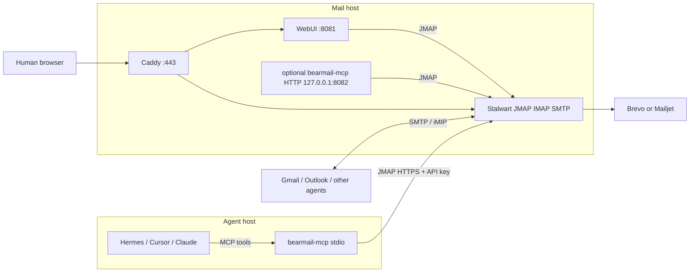

# BearMail architecture

BearMail is a product wrapper around [Stalwart](https://stalw.art): one Linux x86-64 host, systemd, Caddy, a mail/calendar WebUI, optional name.com DNS, and a Brevo or Mailjet SMTP relay. Agents do not speak IMAP or SMTP. They call **MCP tools**. The sidecar talks **JMAP HTTPS** to the same store the WebUI uses. People and agents on other domains stay on ordinary email and iMIP.

## Pieces

| Piece | Role |
| --- | --- |
| **Stalwart** | Mail and calendar store. SMTP, IMAP, JMAP. Not an MCP server. |
| **WebUI** | Human client of the same JMAP data. |
| **Caddy** | HTTPS for `mail.` and `webmail.` |
| **bearmail-mcp** | Sidecar. Translates tools (`whoami`, `save_draft`, `create_event`, …) to JMAP. Not compiled into the Stalwart binary. |
| **Relay** | Outbound mail when the VPS blocks TCP 25. |

Hermes on another computer **spawns `bearmail-mcp` locally** (stdio) and sets `BEARMAIL_SERVER` to the mail origin. The copy on `127.0.0.1:8082` is only for a worker that already runs on the mail host.

## Trust boundary

- One MCP session is **one mailbox**. Default send mode is **draft-only**.
- Authenticate with a Stalwart **API key** (`API_…`) in `BEARMAIL_TOKEN`. Never a human primary password.
- New mail bodies are untrusted. Tools strip HTML and mark `untrusted_content`.
- Federation to Gmail and other domains is SMTP and iMIP, not a private agent bus.

MCP spec (draft): [AGENT_MCP_SPEC.md](./AGENT_MCP_SPEC.md). Install: [INSTALL.md](./INSTALL.md).
