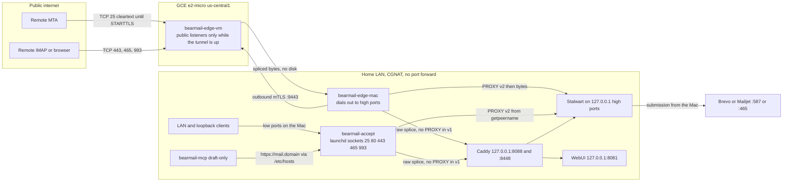
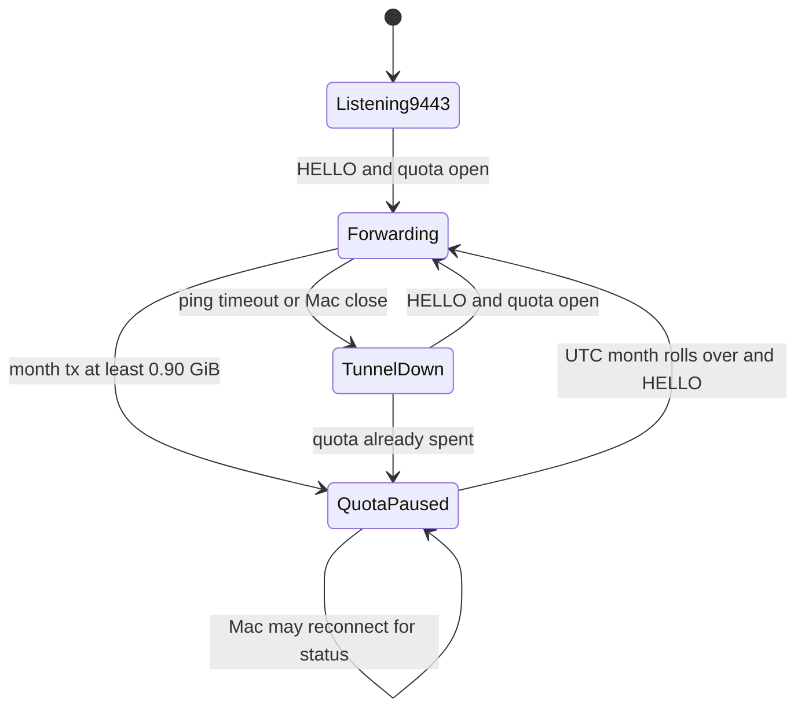
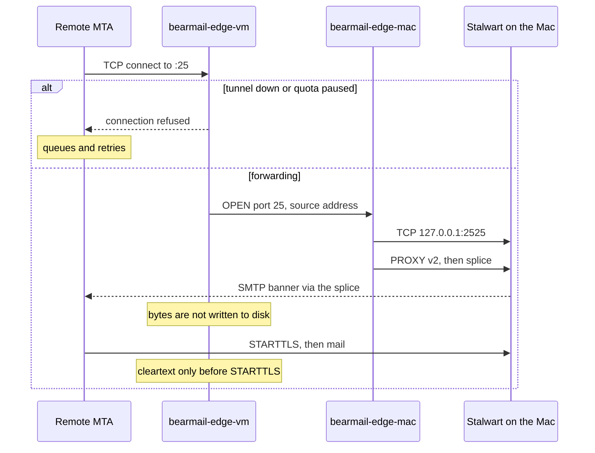
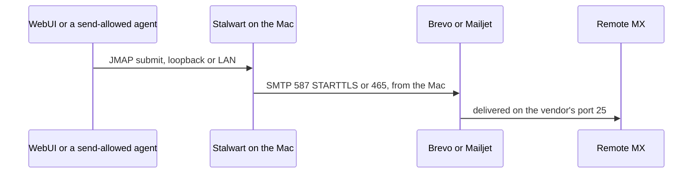

# BearMail on macOS, with a stateless Google Cloud edge

| Field | Value |
| --- | --- |
| Author | BearMail design |
| Date | 2026-09-29 |
| Status | Draft |
| Revision | Review issues 1–15 addressed on 2026-09-29. Repository split and WebUI/MCP placement recorded on 2026-09-29. |
| Product | BearMail (Stalwart packaging + WebUI + MCP) |
| Scope | macOS Apple Silicon packaging of the existing single-host product, plus a forward-only edge on one Always Free `e2-micro` |
| Supersedes | Nothing. The Linux x86-64 installer stays the supported server path. |

## Overview

BearMail today is one Linux x86-64 host. Stalwart stores mail and calendar data and speaks SMTP, IMAP, JMAP, and CalDAV. Caddy publishes `mail.` and `webmail.` on 80/443. A Node WebUI and the `bearmail-mcp` sidecar sit on loopback. Outbound mail leaves through Brevo or Mailjet on 587/465 because cloud networks block outbound TCP 25 by default for destinations outside the VPC. That shape cannot move onto a home Mac: the Mac is usually behind CGNAT, home ISPs block outbound TCP 25, and the router must not be port-forwarded. It also cannot move onto the Always Free VM: an `e2-micro` has 1 GB of RAM and a quarter of a shared core, and Google blocks outbound TCP 25 from that VM to external destinations by default.

This design adds a second deployment in the same repository and on the same `main` branch. It does not add a long-lived `macos` branch and it does not copy the mail engine. The Mac runs the same mail stack the Linux host runs now: Stalwart, the WebUI, Caddy, Brevo or Mailjet submission, name.com DNS updates, and `bearmail-mcp`. All mail blobs, RocksDB data, mail TLS private keys, and mailbox credentials stay on the Mac. A new pair of programs, `bearmail-edge`, carries public TCP from one Google Cloud `e2-micro` to the Mac. The Mac dials out. The VM never stores mail. When the tunnel is down, or when the free egress budget is spent, the VM stops accepting public connections. Remote MTAs retry, which is normal MX behavior. Remote clients fail closed. Clients on the Mac and on the LAN talk to listeners launchd owns on the Mac, so those bytes are not GCP egress. Sent mail leaves the Mac directly for Brevo or Mailjet and does not cross the VM.

The VM is not free to operate in the sense operators often mean. The Always Free tier covers the `e2-micro` hours, 30 GB-months of standard persistent disk, and 1 GB of North America egress (with destination exclusions). It does not cover a public IPv4 address beyond one hour per month. At the list price fetched on 2026-09-29, an in-use external IPv4 on a standard VM is **$0.005 per hour**, about **$3.65 in a 730-hour month** after the one free hour. "Free forever" in this document means only the Always Free limits. The IPv4 line is a required cost. Egress past the free gibibyte is a separate line, and the product hard-stops internet forwarding before that line is supposed to grow.

## Background and motivation

### What the Linux product is

BearMail is a packaging and MCP layer around Stalwart, not a second mail store. The current release is explicit about the platform:

- `README.md` and `docs/LIMITATIONS.md` require one Linux **x86-64** host with systemd. There is no macOS build, no ARM build, and no launchd service in this release. `VERSION` is `0.1.0`. The engine package in `crates/main/Cargo.toml` is Stalwart `0.16.16`, `edition = "2024"`, default features `rocks` and `enterprise`.
- `docs/ARCHITECTURE.md` is the runtime picture: Caddy on 443, WebUI on 8081, Stalwart for JMAP/IMAP/SMTP, optional `bearmail-mcp` on `127.0.0.1:8082`, humans through Caddy, the rest of the world through SMTP and iMIP, outbound through Brevo or Mailjet.
- `install.sh` is the interactive installer. It places Stalwart at the standard prefix (`/usr/local/bin`, `/etc/stalwart`, `/var/lib/stalwart`) or a custom prefix, installs the WebUI under `/opt/stalwart-webui`, and binds the WebUI to `127.0.0.1` (default port **8081**; **8080** is reserved for Stalwart). Automatic mode installs Caddy, moves Stalwart's `http` and `https` listeners to `127.0.0.1:8080` and `127.0.0.1:8443` (`install.sh`, the `x:NetworkListener/set` call), sets `useXForwarded`, and writes an installer-marked Caddyfile. `write_caddy_configuration_file` sends the mail hostname plus `mta-sts`, `ua-auto-config`, `autoconfig`, and `autodiscover` to `127.0.0.1:8080`, and the WebUI hostname to `127.0.0.1:8081`. The same Caddy path sets the primary domain's `certificateManagement` to `Manual` (`x:Domain/set` in `install.sh`).
- A root-only timer, `stalwart-caddy-cert-sync`, copies Caddy's mail-host certificate into Stalwart so IMAPS and SMTPS can use it (`install_caddy_certificate_sync`). The unit is `Type=oneshot`, driven by `OnBootSec=2min` and `OnUnitActiveSec=15min`. It restarts Stalwart only when the files change. Renewal today is Caddy's default HTTP-01 / TLS-ALPN-01 path, which needs the public 80/443 listeners to reach this host.
- The installer prints the administrator password once on a fresh internal-directory install (`docs/INSTALL.md`).
- Firewall text in `install.sh` is the public port list operators are told to open: **80, 443, 25, 465, 993**. It tells them to leave **8080, 8081, and 8443** closed. Outbound is 443, DNS 53, and **587 or 465 to the relay**. Inbound **587 is not in that list**.
- Stalwart's own first-run listeners, in `crates/common/src/manager/defaults.rs`, are `smtp` **25** (STARTTLS), `submissions` **465** (implicit TLS), `imaps` **993**, `pop3s` **995**, `sieve` **4190**, `https` **443**, and `http` **8080**, bound to `[::]`. The installer then takes 443 and 8080 away from the public interfaces. POP3S and ManageSieve stay bound, but they are not part of the published firewall list.
- DNS is name.com or manual. `publish_dns_via_namecom` / `build_namecom_dns_plan` push A, AAAA, CNAME, MX, TXT, and SRV through `https://api.name.com/v4`. The API call takes the **username and the token**. The A/AAAA answers come from the host's detected public address (`write_installer_state`, ipify in `install.sh`). `mergeRelaySpf` inserts `include:spf.brevo.com` or `include:spf.mailjet.com` in front of the existing `all` mechanism and does not remove `a` or `mx`. `tests/resources/scripts/install_namecom_plan_test.sh` expects `v=spf1 mx include:spf.brevo.com -all` and `v=spf1 a include:spf.brevo.com -all`. The Linux installer refuses to store the token in `installer-state.json`. PTR is printed as guidance and is not written to the domain zone.
- Outbound relay: `configure_optional_smtp_relay` defaults to Brevo (`smtp-relay.brevo.com`, port 587 or 465) and can use Mailjet (`in-v3.mailjet.com`). It creates an `MtaRoute` and points remote delivery at it. Local recipients stay local. `docs/BREVO_SMTP_RELAY.md` states why: Google Cloud blocks outbound TCP 25, and Stalwart cannot call Brevo's HTTP API. That page also tells Linux operators to keep `ip4:`, `ip6:`, `a`, and `mx` terms. The macOS publisher must not follow that sentence. See DNS and certificates.
- `small-memory-optimize.sh` is a post-install tune for a **full mail server** on a ~1 GB VM: 16 MB RocksDB write buffer, 2 GB swap, journald and systemd memory caps, WebUI heap cap, and it disables the Google Cloud Ops Agent. It does not change ports, DNS, or the store. It is the wrong program to run on the edge VM, and it is not how this design fits mail onto an `e2-micro`.
- MCP is a separate Node process (`mcp/`, `mcp/bearmail-mcp.service`, `User=stalwart-webui`). `loadConfig` in `mcp/src/config.ts` defaults `BEARMAIL_SEND_MODE` to `draft-only`, scopes to `mail.read`, `mail.draft`, `calendar.read`, and `calendar.write`, daily cap 50, HTTP bind `127.0.0.1:8082`. `sendEmail` and `reply` in `mcp/src/account.ts` honor draft-only. `createEvent`, `updateEvent`, `rsvp`, and `cancelEvent` pass `sendSchedulingMessages` without consulting `sendMode` or `SendQuota`. Calendar iMIP is not draft-gated. That is existing behavior, not a macOS feature. Linux already splits users: `resources/systemd/stalwart-mail.service` is `User=stalwart` with `AmbientCapabilities=CAP_NET_BIND_SERVICE`; `webui/stalwart-webui.service` is `User=stalwart-webui`.
- CI (`.github/workflows/ci.yml`) is a policy stub. It is `workflow_dispatch` only, job `linux-only` on `ubuntu-latest`, and the step echoes that BearMail does not build ARM, macOS, Windows, FreeBSD, or Docker images. It does not compile Stalwart. The published artifact of the Linux release is an x86-64 `stalwart` binary plus `stalwart-webui.tar.gz`.
- `resources/systemd/stalwart.mail.plist` is an upstream Stalwart label (`stalwart.mail`) with `RunAtLoad` and `KeepAlive` only. It is not a BearMail macOS product: no user, no logs, no WebUI, no Caddy, no tunnel, no sleep policy. It is not reused.

### Why a home Mac needs an edge that is not the mail server

The Mac has the CPU, RAM, and disk. The network in front of it does not. CGNAT means the home router has no public inbound address to forward, and this product must not ask the operator to forward one anyway. Outbound TCP 25 from the home ISP is commonly blocked, so the Mac cannot be a direct MX sender any more than a GCE VM can. Brevo or Mailjet on 587/465 remains the outbound path, and that path starts on the Mac, not on the VM.

The Always Free VM exists only because something on the public internet has to accept inbound port 25 and the client ports, and because the operator asked for that edge to be a Google Cloud always-free VM. Google documents outbound TCP 25 to destinations outside the VPC as blocked by default, while 587 and 465 are not, and notes that some projects are later allowed once the block is lifted (`https://docs.cloud.google.com/compute/docs/tutorials/sending-mail`, page updated 2026-09-24). Inbound port 25 is not documented as blocked. Some paths drop it anyway. Receiving mail on this VM is a spike, not an assumption. A successful outbound-25 probe from the VM is not an inbound result and does not make the VM a sender.

## Goals and non-goals

### Goals

1. One household domain on one always-on Apple Silicon desktop Mac, with the same mailbox, calendar, JMAP, WebUI, and MCP behavior as the Linux product. One store, on the Mac. Loopback and LAN clients reach a real listener on 25, 80, 443, 465, and 993.
2. Public inbound TCP for the ports BearMail actually publishes, terminated as TLS on the Mac, carried by a tunnel the Mac opens.
3. The VM forwards bytes and meters them. It holds a tunnel CA certificate and a tunnel server key, and nothing else that is a secret. It does not hold mail certificates, mailbox passwords, API keys, the name.com username or token, the relay password, RocksDB, or mail blobs.
4. Outbound internet mail still uses the existing Brevo (default) or Mailjet relay from the Mac.
5. name.com remains the automated DNS path. A and MX point at the VM's static IPv4, never at the home address. SPF does not authorize that address.
6. Certificate issuance does not depend on the tunnel or on a public listener. DNS-01 uses the name.com v4 API BearMail already calls (`https://api.name.com/v4`, username and token). Caddy only reads the certificate files that helper writes.
7. When the tunnel is down, the VM does not accept public mail connections. When measured egress approaches the free allowance, internet forwarding stops. LAN and loopback on the Mac keep working, because their listeners are launchd sockets, not the VM. The Mac shows that state.
8. MCP stays draft-only by default. Scopes stay process policy. This design does not claim that calendar invites are draft-gated.
9. A human can install it without `curl | bash` as the only Mac path, and can see the real monthly cost before they attach the address.

### Non-goals

- Replacing the Linux installer, or running Stalwart on the `e2-micro`. `small-memory-optimize.sh` is not part of this design.
- A long-lived `macos` branch, a second repository, or a Darwin branch inside `install.sh`. The split is directories on `main`. See Repository layout.
- Running the WebUI or `bearmail-mcp` on the VM. Both stay on the Mac. The VM has no mailbox password and no `API_` key.
- A second mail store, a cluster, or high availability. One Mac is down means mail waits at the sender.
- Laptop operation, Intel Macs, and universal binaries in v1. A MacBook is refused even when `hw.optional.arm64` is 1.
- Inbound port 587, POP3S (995), and public ManageSieve. See the port matrix. 587 remains an outbound relay port.
- Fixing the calendar iMIP draft-mode bug in the macOS v1 cut. A follow-up PR is specified so nobody confuses "not in v1" with "already safe."
- IPv6 as a way to avoid the IPv4 charge. External IPv6 on a VM is uncharged, but IPv4-only senders still need an A record and inbound 25 on that A record. The Mac does not bind `::1`.
- Cloudflare, Tailscale, or a second GCE instance. A second `e2-micro` on the same billing account consumes the same free hours. The limit is the billing account, not the project.
- Direct MX delivery from the Mac or the VM on port 25. Outbound 25 stays blocked by default or unreliable; the relay stays.
- Storing tunnel logs that contain SMTP payloads, AUTH exchanges, or message bodies.
- Multi-domain hosting, multiple Macs, or one VM fronting more than one household.
- A uid-scoped PROXY trust. Stalwart matches the peer IP only. This design states that limit instead of inventing a filter `listen.rs` does not have.
- HTTP client-IP fidelity on the Mac. v1 does not block on it.

## Proposed design

### Repository layout

One repository, one default branch (`main`). A pull request is a short-lived branch cut from `main`, merged, and deleted. The Mac product can sit on `main` before anyone is told to install it. `README.md` keeps the Linux install command until `docs/INSTALL-MACOS.md` exists. Until that page exists, Linux is the only supported install path.

| Path | Product | Rule |
| --- | --- | --- |
| `install.sh`, `release_install.sh`, `upgrade.sh`, `resources/systemd/`, `docs/INSTALL.md` | Linux server. One machine, public address, no tunnel. | A Mac change does not edit these. `install.sh` does not detect Darwin, write a plist, or provision Google Cloud. |
| `crates/`, `webui/`, `mcp/` | Shared mail engine, web app, and agent sidecar. | Built for both products. Not copied into `packaging/macos/`. A behavior change here ships to Linux and Mac together. |
| `packaging/macos/`, `resources/launchd/com.bearmail.*.plist`, `docs/INSTALL-MACOS.md` | Mac mini: launchd, DNS-01, the listener profile, `bearmail-setup`, the menu bar. | Install prefix `/usr/local/bearmail`. Does not call `mergeRelaySpf`. |
| `edge/` | The tunnel. The VM half is a Linux binary, and it belongs to the Mac product. | Stores no mail. Does not link `store`. Does not call `install.sh` or `small-memory-optimize.sh`. |

`resources/systemd/stalwart.mail.plist` is the upstream Stalwart label. BearMail's plists are `resources/launchd/com.bearmail.*.plist`. The two names do not overlap, and the upstream file is not the Mac product.

On-disk prefixes do not overlap either. Linux stays `/usr/local/bin/stalwart`, `/etc/stalwart`, `/var/lib/stalwart`, and `/opt/stalwart-webui`, with users `stalwart` and `stalwart-webui`. The Mac uses `/usr/local/bearmail` and `_bearmail`, `_bearmail_tls`, `_bearmail_edge`, and `_bearmail_web`. The VM uses `/etc/bearmail-edge` and `/var/lib/bearmail-edge`, which are not `/etc/stalwart`.

A pull request that edits both `install.sh` and `packaging/macos/` needs a written reason in the PR body. The usual reason is a shared name.com HTTP helper, and `docs/INSTALLER_RELAY_DNS_TEST_PLAN.md` still has to pass. Copying that transport into `bearmail-setup` is allowed when the extraction cannot be proved. Changing `mergeRelaySpf` is not.

CI is two jobs. The Linux release artifact stays the x86-64 `stalwart` binary and `stalwart-webui.tar.gz`. A separate Apple Silicon job builds `aarch64-apple-darwin` and, from PR 11, `BearMail-<version>-arm64.pkg`. A failure in the Mac job does not block a Linux release. The package is not a file inside the Linux archive. The VM binary is a second file in the Mac release, not in the Linux archive.

`docs/LIMITATIONS.md` and `README.md` gain a pointer to `docs/INSTALL-MACOS.md` in PR 11. That pointer states Apple Silicon, the IPv4 charge, and the port-25 spike. It does not weaken the Linux requirements, and it does not replace the Linux quick-install command.

### Placement



The VM is in `us-central1` (Iowa) unless the operator overrides it to `us-west1` or `us-east1` at bootstrap. Those are the only Always Free regions (`https://docs.cloud.google.com/free/docs/free-cloud-features`, fetched 2026-09-24, re-read 2026-09-29). Free `e2-micro` time is one instance-month combined across those regions, per billing account, not per project. The bootstrap script treats a second `e2-micro` on that billing account as a refusal. A check that only looks at the current project is not the free-tier check. See the install story.

Machine shape, from `https://docs.cloud.google.com/compute/docs/general-purpose-machines` (fetched 2026-09-29): `e2-micro` exposes 2 vCPUs, fractional vCPU **0.25**, **1 GB** memory, maximum egress bandwidth up to 1 Gbps, no local SSD. Sustained scheduling is two vCPUs at 12.5% of CPU time each (25% of a core). That is enough to splice a household's SMTP and IMAP. It is not enough to run Stalwart, the spam filter, RocksDB, Node, and Caddy. Those stay on the Mac.

### Components

| Component | Where | Process model | Holds secrets or mail? |
| --- | --- | --- | --- |
| `stalwart` | Mac, `aarch64-apple-darwin`, user `_bearmail` | LaunchDaemon | Yes. The only store. Brevo or Mailjet password in its config. Reads the mail cert via group `_bearmail_certs`. |
| `bearmail-acme` | Mac, user `_bearmail_tls` | LaunchDaemon oneshot, with cert-sync | name.com username and token. Writes certificate files. No mailbox store. |
| Caddy (stock build, file TLS) | Mac, user `_bearmail_tls` | LaunchDaemon | Mail TLS private key in its own directory. Not copied to the VM. Not a DNS module. |
| WebUI `server.mjs` | Mac, vendored Node 22, user `_bearmail_web` | LaunchDaemon, `127.0.0.1:8081` | No mailbox store, no mail key, no name.com token. Session cookies stay in the browser, as today. |
| `bearmail-mcp` | Mac, user `_bearmail_web` | LaunchDaemon, `127.0.0.1:8082`, and stdio for agent hosts | API key in a `0600` file under the web user's directory. Draft-only. Cannot read `data/`, `etc/`, `edge/`, or the name.com token. |
| `bearmail-edge-mac` | Mac, user `_bearmail_edge` | LaunchDaemon | Tunnel client key and CA key. Dials Stalwart and Caddy high ports. |
| `bearmail-accept` | Mac, user `_bearmail_edge` | LaunchDaemon, descriptors from launchd `Sockets` | No mail key and no name.com token. Same user as the edge client because both are the network-edge trust. Accept does not need the client key; the directory is still `0700` so other users cannot read it. |
| Menu-bar app | Mac, logged-in user | LSUIElement Swift app | No. Reads a status file. |
| `bearmail-edge-vm` | e2-micro, linux amd64 static, user `bearmail-edge` | systemd | Tunnel server key and CA cert. No mail keys, no name.com token, no Brevo key, no `API_` token. |
| GCP service account `bearmail-edge` | The VM's identity | No IAM roles, `--no-scopes` | No JSON key is created or copied. The binary calls no GCP API. |
| Brevo or Mailjet | Vendor | Existing `MtaRoute` | Relay password in Stalwart config on the Mac, same as `configure_stalwart_smtp_relay`. |
| name.com | Vendor | DNS API and DNS-01 from the Mac only | Username and token on the Mac only, mode `0600`, owner `_bearmail_tls`. |

Two new binaries from one small Rust crate `edge/` with its own `Cargo.toml`: `bearmail-edge` (subcommand `mac`, `accept`, or the VM main) and the VM binary. The crate must not link `store`, RocksDB, or the Stalwart server. Target idle RSS on the VM is under 30 MB, and under 80 MB at the connection cap. No Docker on either side. Docker's daemon plus a container image does not fit the RAM story, and the VM has nothing to isolate beyond one static binary.

`bearmail-acme` is a small helper in the Mac package, not a Caddy module. It speaks `https://api.name.com/v4` the way `publish_dns_via_namecom` already does, with the username and the token, and it runs an ACME DNS-01 client (lego or an equivalent client this repo owns). Caddy's Caddyfile points `tls` at the files it writes. A forked `libdns` provider linked into Caddy is the rejected alternative: issuance would again depend on a Caddy build, which is the failure mode this section exists to avoid.

### Port matrix

Published on the VM's public IPv4, and forwarded only while the control channel is healthy and the quota state is open:

| VM listen | Mac edge dials | Real service | Why this port |
| --- | --- | --- | --- |
| `0.0.0.0:25` | `127.0.0.1:2525` | Stalwart `smtp`, STARTTLS | MX. Documented in `install.sh`. |
| `0.0.0.0:465` | `127.0.0.1:2465` | Stalwart `submissions`, implicit TLS | Documented SMTPS. |
| `0.0.0.0:993` | `127.0.0.1:2993` | Stalwart `imaps` | Documented IMAPS. |
| `0.0.0.0:80` | `127.0.0.1:8088` | Caddy | HTTP redirect, MTA-STS fetch, and a health URL. Not the ACME path. |
| `0.0.0.0:443` | `127.0.0.1:8448` | Caddy, then `127.0.0.1:8080` or `:8081` | JMAP, admin, webmail, discovery names. |

Control plane, not a mail port:

| VM listen | Who dials | Notes |
| --- | --- | --- |
| `0.0.0.0:9443` | Mac only, mTLS | No PROXY, no SMTP. Stays up when forwarding is paused so the Mac can still read quota state. |

Not published on the VM:

| Port | Linux behavior | macOS v1 |
| --- | --- | --- |
| 587 | Outbound to the relay. Not a default listener (`defaults.rs` has `submissions` on 465, not 587). | Still outbound, from the Mac to Brevo or Mailjet. The VM does not listen. Port 587 is advertised only when `service.cleartext` is true (`crates/common/src/network/dns/records.rs`, `legacy_autoconfig.rs`, `autodiscover.rs`). The macOS profile keeps SMTP `cleartext` false, so 587 is not advertised. It does not open a black-hole port. |
| 995 `pop3s` | Bound on `[::]` by default, not in the `install.sh` firewall list. Default `SystemSettings.services` includes `Pop3`. | The `pop3s` listener is disabled, and `ServiceProtocol::Pop3` is removed from `services`. Disabling the listener alone still advertises `_pop3s._tcp` port 995. |
| 4190 ManageSieve | Bound on `[::]`, not in the firewall list. 4190 is unprivileged. | Bound to `127.0.0.1:4190` only, not forwarded. |
| 8080, 8081, 8443 | Loopback after install. | Same roles: Stalwart HTTP, WebUI, Stalwart HTTPS. Never forwarded. The edge's Caddy dial port is **8448**, not 8443, so it does not collide with Stalwart's loopback HTTPS listener. |
| 22 | n/a | Not open to `0.0.0.0/0`. Admin SSH is IAP only (`35.235.240.0/20` to tcp/22), or not installed and the operator uses the serial console. |

#### Mac listeners: launchd `Sockets`, then high ports

Low ports on the Mac are bound by launchd, as root, before the daemon runs. `com.bearmail.accept` runs as `_bearmail_edge` and takes the descriptors with `launch_activate_socket`. One named socket per port, each:

```xml
<key>SockType</key><string>stream</string>
<key>SockFamily</key><string>IPv4</string>
<key>SockNodeName</key><string>0.0.0.0</string>
<key>SockServiceName</key><string>25</string>
```

The five names are `smtp` (25), `submissions` (465), `imaps` (993), `http` (80), and `https` (443). `0.0.0.0` includes `127.0.0.1`. The plist does not also bind `127.0.0.1` (that would be `EADDRINUSE`) and does not bind `::` or `::1`. `/etc/hosts` on the Mac is an IPv4 line only, so `mail.<domain>` and `webmail.<domain>` resolve to `127.0.0.1` and hit this `:443` and `:80`. There is no `::1` hosts line. v1 publishes no AAAA.

`bearmail-accept` calls `getpeername` on the accepted socket.

- Ports 25, 465, and 993: dial `127.0.0.1:2525`, `:2465`, or `:2993`, write a PROXY v2 header whose source is that peer, then splice. The client's own bytes are not the PROXY header.
- Ports 80 and 443: dial `127.0.0.1:8088` or `:8448` and splice raw bytes. No PROXY header in v1. Stock Caddy would treat a PROXY preamble as HTTP and break the request.

The edge client does not use these sockets. It dials the high ports on `127.0.0.1` directly. For 2525, 2465, and 2993 it writes PROXY v2 from the `OPEN` source, then splices. For 8088 and 8448 it splices raw bytes, same as accept. A future flag `caddy_proxy` lives in one file both Mac processes read, `/usr/local/bearmail/edge/caddy-proxy` (default absent, meaning false). It must not be set on only one of them. v1 leaves it false. See API and interface changes.

High ports stay on `127.0.0.1` only, so a LAN client cannot skip accept. They are unprivileged, so Stalwart and Caddy are not root. launchd is the thing that binds below 1024. That is the macOS replacement for `CAP_NET_BIND_SERVICE` on `resources/systemd/stalwart-mail.service`. macOS `pf` is not on this path. An anchor file that `pf.conf` never loads is not a listener, `lo0` `rdr` is the footgun this design refuses, and Apple's stock `pf.conf` is replaced by OS updates. There is no `pf` anchor, no `pfctl` step, and no `bearmail-setup pf-reload`.

These launchd sockets stay bound when the tunnel is down and when the quota pause unbinds the VM's public ports. "LAN and loopback keep working" means a client can complete TCP to the Mac's 25, 80, 443, 465, and 993 in those states. The VM's five public ports are the ones that unbind.

| Mac listen | Bound by | Next hop |
| --- | --- | --- |
| `0.0.0.0:25`, `:465`, `:993`, `:80`, `:443` (IPv4) | launchd, accepted by `bearmail-accept` | PROXY to Stalwart high ports, or raw splice to Caddy |
| `127.0.0.1:2525` | Stalwart `smtp` | The store |
| `127.0.0.1:2465` | Stalwart `submissions` | The store |
| `127.0.0.1:2993` | Stalwart `imaps` | The store |
| `127.0.0.1:8088`, `:8448` | Caddy | `127.0.0.1:8080` or `:8081` |
| `127.0.0.1:8080`, `:8443` | Stalwart HTTP and HTTPS | Not reachable from the LAN |
| `127.0.0.1:8081` | WebUI | Not forwarded |
| `127.0.0.1:4190` | Stalwart sieve | Not forwarded |
| `127.0.0.1:8082` | MCP | Not forwarded |

#### PROXY trust is the peer IP, on three listeners only

System `proxyTrustedNetworks` (`SystemSettings` in `crates/registry/src/schema/structs.rs`) stays **empty**. A listener copies that system list into `proxy_networks` whenever its own `overrideProxyTrustedNetworks` is empty (`crates/common/src/config/server/listener.rs`). `listen.rs` then requires a PROXY header when the accepted peer IP matches (`has_proxies && network.matches(&remote_addr.ip())`). A parse failure logs `ProxyError` and does not call `build_session`, so the connection is dropped. It does not fall through to the protocol.

The macOS profile sets `overrideProxyTrustedNetworks` to `127.0.0.1/32` and `::1/128` only on `smtp`, `submissions`, and `imaps`, via `x:NetworkListener/set`. `http` (`127.0.0.1:8080`), `https` (`127.0.0.1:8443`), and `sieve` (`127.0.0.1:4190`) keep an empty override. With the system list empty, their `proxy_networks` is empty, `has_proxies` is false, and they take the `else` branch in `listen.rs` that accepts raw protocol bytes. Caddy, from `write_caddy_configuration_file`, dials `127.0.0.1:8080` and sends HTTP. Those bytes are not a PROXY header. Putting the loopback networks on the system property would make that upstream fail, and webmail, JMAP, admin, and the discovery names with it. `useXForwarded` is a separate `x:Http/set` field (`install.sh`) and does not skip this parser. The profile still sets it, for the same reason the Linux installer does. It does not recover a client IP.

`crates/common/src/network/security.rs` also inserts `system.proxy_trusted_networks` into the permanent IP allow set. The per-listener override is not that list. Leaving the system property empty avoids allowlisting `127.0.0.1` for every listener. The profile writes the system property as `{}` so a quick-setup value cannot leak back in.

There is no uid check. `bearmail-edge-mac`, `bearmail-accept`, and any other local process that can connect to `127.0.0.1:2525`, `:2465`, or `:2993` are the same peer. Any of them can prepend a forged PROXY v2 header, and Stalwart will record that source. The VM's public address is not in the override, so a remote client who somehow reached Stalwart directly could not. They cannot reach it: the high ports are loopback, and the low ports are accept, which writes its own header before the client's bytes. A local process that connects to `127.0.0.1:8080` or `:4190` is not on a PROXY-trusting listener. Its bytes are HTTP, TLS, or ManageSieve, not a client-IP forgery.

A LAN client is not that peer. Their TCP peer is their RFC1918 address on the launchd socket. accept writes the header. They would have to open `127.0.0.1` on the Mac, which they cannot do from another machine, to forge one.

This is the v1 trust statement. Apple `pf` is not used to pretend there is a user match. Narrowing the trust to "only the edge binary" would require a listener Stalwart does not have. The residual risk is in the risk table: a local process can spoof the client IP in `Received` and in IP reputation. It does not, by itself, authenticate to a mailbox. The user split below is what keeps the WebUI and MCP from also being able to read the store and the keys. It does not stop them opening a TCP connection to `127.0.0.1:2525`.

### Tunnel protocol

The chosen design is a custom mutual-auth TCP tunnel, not SSH and not WireGuard. The comparison is in Alternatives. The VM is a userspace splice. It does not NAT, so it does not need conntrack entries for every remote MTA.

**Handshake.** The Mac dials the static IPv4 on `tcp/9443`, not a hostname. Both sides require TLS 1.3 with mutual authentication, ALPN `bearmail-edge/1`. The VM presents `server.pem`. The Mac's rustls verifier requires a certificate signed by the tunnel CA whose only subject alternative name is an `iPAddress` equal to that static IPv4. A DNS SAN is rejected. There is no `edge.<mail-domain>` A record. The certificate is not the mail certificate and it is not presented on 25, 443, 465, or 993. The Mac presents `client.pem`, signed by the same CA, extended key usage clientAuth. The VM stores `ca.pem` (no private key), `server.pem`, and `server.key`. The Mac stores `ca.key`, `client.key`, and the copies it generated before the operator copied the server material. There is no shared mailbox password and no PSK in the repo.

**Who mints the server certificate.** The Mac does, during `bearmail-setup`, as files under `/usr/local/bearmail/edge` (mode `0700`, owner `_bearmail_edge`):

1. `ca.key` and `ca.pem`. ECDSA P-256, `CA:TRUE`, path length 0. The CA key never leaves the Mac.
2. `client.key` and `client.pem`, signed by that CA. These never leave the Mac.
3. `server.key` and `server.pem`, signed by that CA, extended key usage serverAuth, validity 90 days, SAN a single `iPAddress` of the static IPv4 the operator reserved.

The wizard prints the SHA-256 of `ca.pem`, `server.pem`, and `client.pem`, and prints the copy list: **`ca.pem`, `server.pem`, `server.key` only**. It tells the operator not to copy `ca.key`, `client.pem`, or `client.key`. Cloud Shell step 6 is `gcloud compute scp` of those three files and only those three. `provision-vm.sh` on the VM takes separate slots:

```text
provision-vm.sh \
  --ca /tmp/ca.pem \
  --server-cert /tmp/server.pem \
  --server-key /tmp/server.key \
  --static-ipv4 <reserved address> \
  --expect-server-sha256 <fingerprint the wizard printed>
```

There is no `--client-key` flag. An unknown flag is an error. Before the unit is installed, the script exits if any check fails:

- `ca.pem` and `server.pem` each contain a certificate and no `PRIVATE KEY` block.
- `server.key` contains exactly one `PRIVATE KEY` block, and its public key matches `server.pem`.
- No other input file contains a `PRIVATE KEY` block. A second private key is a hard error. That is the check that catches a pasted CA key or a client key in the wrong slot.
- `server.pem` chains to `ca.pem`.
- The SAN set is exactly one `iPAddress`, equal to `--static-ipv4`. A `dNSName` is rejected.
- The SHA-256 of `server.pem` equals `--expect-server-sha256`.

Installed paths are `/var/lib/bearmail-edge/ca.pem`, `server.pem`, and `server.key`, mode `0600`, owner `bearmail-edge`. On every start, `bearmail-edge-vm` repeats the SAN and chain check against the configured IPv4 and refuses to bind `9443` if it fails.

**Renewal.** Lifetime is 90 days. The menu bar reads `notAfter` from the Mac's copy of `server.pem` and warns at 14 days. The operator runs `bearmail-setup renew-tunnel-cert`, which re-signs a server certificate with the same CA and the same `iPAddress` SAN. The operator copies the same three files with the same Cloud Shell step and re-runs `provision-vm.sh` with the same slots. A missed copy means the VM presents an expired certificate, the Mac's handshake fails, the control connection stays down, and the five public ports stay unbound. That is the same user-visible state as a dead tunnel. LAN and loopback keep working. v1 does not push the server key over the tunnel. That would be a second admin channel. Automatic renewal is not in v1.

**One control connection, many streams inside it.** All integers are big-endian. After the handshake, frames are:

```text
uint8  type
uint32 payload_length   # greater than 65536 closes the control connection
byte   payload[payload_length]
```

A fixed-size frame whose `payload_length` is not the size below closes the control connection. An unknown type closes it. The checks apply before the payload is interpreted.

| Type | Name | Payload layout | Direction |
| --- | --- | --- | --- |
| 1 | `HELLO` | `uint16` version = 1, `uint16` npairs = 5, then five `uint16` pairs in this order: `(25, 2525)`, `(465, 2465)`, `(993, 2993)`, `(80, 8088)`, `(443, 8448)`. `payload_length` is 24. | Mac to VM, once |
| 2 | `HELLO_OK` | `uint64` month tx bytes, `uint8` state, `uint16` UTC year, `uint8` month 1–12. `payload_length` is 12. | VM to Mac |
| 3 | `PING` | `uint64` unix milliseconds. `payload_length` is 8. | either, every 15 s |
| 4 | `PONG` | `uint64` echoed timestamp. `payload_length` is 8. | peer |
| 5 | `OPEN` | `uint64` conn id, `uint16` public port, `uint16` src port, `uint8 addr[16]`. `payload_length` is 28. | VM to Mac |
| 6 | `OPEN_OK` | `uint64` conn id. `payload_length` is 8. | Mac to VM |
| 7 | `OPEN_FAIL` | `uint64` conn id, `uint8` reason (1 dial refused, 2 bad port, 3 cap). `payload_length` is 9. | Mac to VM |
| 8 | `DATA` | `uint64` conn id, then bytes. `payload_length` is at most 65536, and `payload_length - 8` is at most 16384. Both checks are required. `payload_length` below 8 closes the control connection. | either |
| 9 | `CLOSE` | `uint64` conn id, `uint8` reason (1 eof, 2 reset, 3 local close). `payload_length` is 9. | either |
| 10 | `QUOTA` | `uint64` month tx bytes, `uint8` state. `payload_length` is 9. | VM to Mac, on change and with hello |

`QUOTA` and `HELLO_OK` state values are `0` open, `1` paused_quota, `2` override. Any other value closes the control connection.

`HELLO` is rejected, and the VM closes, when version is not 1, npairs is not 5, the pairs are not exactly that ordered list, or `payload_length` is not 24. A buggy client cannot ask the VM to publish 587 or 22.

`OPEN.addr` is an IPv4-mapped IPv6 address: `a.b.c.d` is `::ffff:a.b.c.d`. No other family is valid. `AF_UNIX` is not a value. An address that is not IPv4-mapped IPv6 closes the control connection. v1's public listeners are IPv4, so an accepted peer is IPv4. The VM does not invent a second encoding for an IPv6 client.

Conn ids are allocated by the VM, `uint64`, starting at 1, monotonic, and **not reused for the life of the control session**. After `CLOSE` the id stays dead. `DATA`, `CLOSE`, or `OPEN_OK` that names an unknown id or an already-closed id is a protocol error and closes the control connection. A new `HELLO` is a new session; ids start at 1 again.

Version is 1. A version mismatch closes the connection. The Mac retries; it does not fall back to an older, weaker dialect.

`OPEN` is the only way a public byte reaches the Mac. The Mac maps the public port through the table above and dials the loopback high port. For 2525, 2465, and 2993 it writes a PROXY v2 header before any mail bytes, then sends `OPEN_OK` and splices. Encode with `proxy_header::ProxyHeader::encode_to_slice_v2` from crate `proxy-header` 0.1.2, already depended on by `crates/common/Cargo.toml`. `ProxiedStream::create_from_tokio` in `listen.rs` is the parser, not the encoder. Stalwart reads the header before `manager.spawn` starts TLS, so PROXY and then the splice is the order for implicit TLS on 465 and 993. The header's source is the address from `OPEN`, not the VM's address. For 8088 and 8448 the Mac writes no PROXY bytes unless `caddy_proxy` is true, which v1 does not set. `DATA` frames carry at most 16 KiB of payload after the conn id. If the Mac's Stalwart socket blocks, the Mac stops reading `DATA` for that conn id, the VM stops reading the public socket, and the public TCP window closes. The VM does not spool the message to disk.

`bearmail-accept` uses the same `encode_to_slice_v2` call for LAN and loopback peers on 25, 465, and 993. It does not use it on 80 and 443 in v1.

**Single session.** A new successful `HELLO` replaces any previous control connection from this CA. The old session's public sockets are closed. That is how a Mac reboot recovers without a stuck session. Two different client certificates are rejected. v1 is one Mac.

**Liveness.** Ping every 15 seconds. If no `PONG` arrives within 45 seconds, both sides declare the tunnel dead. Home NAT bindings often die after 30 to 120 seconds of idle; the ping is what keeps the CGNAT mapping. Jitter of up to 2 seconds avoids a synchronized stampede that does not matter for one Mac but keeps the timeout test honest.

**Reconnect.** Inside `bearmail-edge-mac`, backoff is 1, 2, 4, 8, 16, then 30 seconds, plus up to 1 second of jitter, forever. launchd `KeepAlive` is the outer restart if the process exits. Backoff lives in the process so a crash loop does not tight-loop, and `ThrottleInterval` on the plist is 10 seconds as a backstop. On every drop, the VM closes all public mail sockets and unbinds 25, 80, 443, 465, and 993. It keeps 9443 bound. It does not accept a public connection "just in case." Connection refused is the SMTP failure mode we want: the remote MTA queues and retries under its own schedule (RFC 5321). Accepting and then dropping, or accepting and returning a banner from the VM, would either look like a successful handoff or like a VM-generated SMTP dialogue. The VM never speaks SMTP. The Mac's launchd sockets are not part of this unbind.

**Cap.** At most 64 concurrent public connections and 64 conn ids. Further accepts are closed immediately while the tunnel is up. That bounds RAM on the 1 GB guest (64 connections times two 16 KiB buffers is about 2 MB, plus socket buffers). A scan cannot pin the guest. Household IMAP plus a few MTAs is far under 64.

**Tunnel down, drawn as states.**



`Forwarding` means the five public ports on the VM are bound. `TunnelDown` and `QuotaPaused` mean they are not. Loopback and LAN on the Mac do not consult this state. Their launchd sockets stay bound in every state in the diagram.

### What happens to one inbound message



Stalwart then does what it does today: spam filter, DKIM verify, local delivery into RocksDB on the Mac. Nothing in that path is relocated.

A client on the Mac or the LAN does not use this picture. They connect to the Mac's launchd socket. accept writes PROXY (mail ports) or splices raw (80/443). The VM is not on that path, and the bytes are not GCP egress.

### What happens to outbound mail



The VM is not on this path. Outbound mail does not consume GCP egress. Home ISPs that block outbound 25 still allow 587 or 465 in the usual case. The installer already accepts 465, 587, 588, and 2525 (`prompt_relay_port` in `install.sh`). Default remains Brevo on 587. If a particular ISP blocks 587, the operator picks 465 at setup, on the Mac, with no VM change.

Local delivery (another mailbox on the same Mac) never leaves the machine, same as `route/else` pointing remote mail at the relay and leaving local domains local.

### DNS and certificates

Public records, published from the Mac through the existing name.com v4 client. The macOS plan builder does **not** call `mergeRelaySpf`.

| Record | Answer |
| --- | --- |
| A `mail.<domain>` | The VM static IPv4. Not ipify-of-the-Mac. |
| A `webmail.<domain>` | The same IPv4. |
| A discovery names the Caddyfile already serves (`mta-sts`, `autoconfig`, `autodiscover`, `ua-auto-config`) | The same IPv4, when the profile's DNS table includes them. |
| MX `<domain>` | `mail.<domain>`, the priority Stalwart already emits. |
| TXT SPF, apex and mail host | Exactly `v=spf1 include:spf.brevo.com ~all`, or exactly `v=spf1 include:spf.mailjet.com ~all`. No `ip4:`, no `ip6:`, no `a`, no `mx`. This is a replacement, not an insert in front of `all`. |
| TXT DKIM | Stalwart's selector, generated on the Mac, plus the operator-added Brevo or Mailjet selector, same split as `docs/BREVO_SMTP_RELAY.md`. |
| TXT DMARC | Whatever Stalwart's setup table already produces. |
| SRV and autoconfig | Only services the macOS profile left in `services`, after Pop3 is removed and SMTP `cleartext` stays false. No `_pop3s._tcp`, no port 995, no port 587. `_submissions._tcp` port 465 and `_imaps._tcp` port 993 stay, because those listeners exist. |

`mergeRelaySpf` in `install.sh` inserts the relay include in front of the existing `all` term and leaves `mx` and `a` in place. The Linux test expects `v=spf1 mx include:spf.brevo.com -all` and `v=spf1 a include:spf.brevo.com -all`. An `mx` or `a` term authorizes the MX and the A record. Both point at the VM. The VM is not a sender. Stripping only a home `ip4:` would still publish that authorization. The macOS publisher replaces the apex TXT and the mail-host TXT with the include and `~all`. The `~all` qualifier is the v1 string. It is not produced by merging Stalwart's usual `-all` with an include. Linux `install.sh` is unchanged, and Linux operators still follow `docs/BREVO_SMTP_RELAY.md`.

Advertisements follow `services`, not the listener set. Default `SystemSettings.services` includes Pop3 and Smtp with `cleartext: false`. In `crates/common/src/network/dns/records.rs`, Pop3 emits `_pop3._tcp` 110 and `_pop3s._tcp` 995, and Smtp emits `_submission._tcp` 587 and `_submissions._tcp` 465. A row is written when `is_tls == 1` or `service.cleartext`, so `cleartext: false` still advertises the implicit-TLS port (995 and 465) and does not advertise 587. `legacy_autoconfig.rs` and `autodiscover.rs` use the same port pairs and the same condition. The macOS profile removes `ServiceProtocol::Pop3`. It does not set SMTP `cleartext` true because port 25 is STARTTLS. Setting it true would advertise 587, and v1 has no listener on 587.

`write_installer_state` today records `publicIpv4` from detection and appends the WebUI A record from that value. The macOS wizard does not call that detection for the published address. It takes the static IPv4 the operator reserved, checks it with a single TCP dial to `9443` (or a later health frame), and passes that address into the name.com plan. AAAA is not published in v1. PTR is not required, because this host does not emit port 25. Setting the VM's PTR to `mail.<domain>` is optional cosmetics and is not a launch gate.

**DNS-01.** Issuance is `bearmail-acme` on the Mac, using the name.com v4 API with the username and the token. The credential file is `/usr/local/bearmail/tls/namecom.env`, mode `0600`, owner `_bearmail_tls`. It is not written into `installer-state.json`, matching the Linux installer. The helper writes the full chain and the private key. Caddy's Caddyfile uses those files (`tls` with paths). Caddy does not run ACME. Renewal is a launchd oneshot every 900 seconds. It talks outbound HTTPS to name.com and to the ACME directory. It does not need port 80 on the VM, and it does not need the tunnel. Public ports may be unbound for the whole renewal. That is deliberate: HTTP-01, which is what unmodified Caddy does on Linux today, fails closed for up to the renewal window whenever the tunnel or the quota pause is down. Port 80 is still forwarded so browsers get a redirect and so MTA-STS policy URLs work. It is not the issuance path.

`github.com/caddy-dns/namecom` is a GitHub 404. The published module is `github.com/caddy-dns/namedotcom` (`dns.providers.namedotcom`), v0.1.2 from April 2021. It does not compile against current Caddy because `github.com/libdns/namedotcom` (v0.3.3, also April 2021) does not match the current `libdns.Record` API (module issue #4, April 2025). That module is a known-broken starting point. It is not a dependency, not a pin, and not a degraded mode. If `bearmail-acme` cannot solve a challenge, the packaging PR fails. There is no "ship Caddy without a certificate" path. IMAPS, SMTPS, and HTTPS have no certificate in that case, which is the correct failure.

The Linux cert-sync timer becomes `com.bearmail.cert-sync`: `KeepAlive` false, `RunAtLoad` true, `StartInterval` 900, `UserName` `_bearmail_tls`. Same rule as `write_caddy_certificate_sync_script`: if the certificate bytes are unchanged, exit 0 and do not restart Stalwart. If they changed, copy the leaf and key into `/usr/local/bearmail/certs` (directory `0750`, owner `_bearmail_tls`, group `_bearmail_certs`, files `0640`) and `touch` `/usr/local/bearmail/run/reload-stalwart`. A root LaunchDaemon `com.bearmail.reload` has `KeepAlive` false and `WatchPaths` on that stamp file. Its program is `launchctl kickstart -k system/com.bearmail.stalwart`. `_bearmail_tls` cannot kickstart a system daemon; root is the only user that runs this job, and the job does not read secrets. The stamp file is created by the package, owner `_bearmail_tls`, mode `0644`. An unchanged certificate does not touch it, so Stalwart is not restarted. Long-running daemons keep `KeepAlive` true and `ThrottleInterval` 10. cert-sync and reload do not.

On the Mac itself, `/etc/hosts` maps `mail.<domain>` and `webmail.<domain>` to `127.0.0.1` so the WebUI, admin, and MCP on that machine do not hairpin through GCP. The name matches the certificate. The connection lands on launchd's `0.0.0.0:443`, which accept splices to Caddy. Other LAN devices do not use that hosts file. If they look up the public name they will egress through the VM and spend the free gibibyte. The menu bar says so. v1 does not run split-horizon DNS. A LAN client that should stay off GCP uses the Mac's RFC1918 address and the low ports (443, 993, 465). The certificate will not match that raw address. The recommended v1 setup for a phone that should not spend egress is still a name DNS-01 can put on the certificate, resolving only on the LAN to the Mac, or the public name with the operator watching the meter. The public name from the LAN is the default, and it is metered.

### Mac service model

Supported hardware is an always-on desktop Mac on AC power: Mac mini, iMac, Mac Studio, or Mac Pro, Apple Silicon. The installer refuses anything else.

Laptop detection, any one match refuses the install:

- `sysctl hw.model` contains `MacBook`, or
- `system_profiler SPHardwareDataType` reports a Model Name containing `MacBook`, or
- `pmset -g batt` reports `InternalBattery`.

A MacBook is unsupported even when `hw.optional.arm64` is 1, and even on AC power. `pmset -c` is the AC profile only. It does not apply on battery (`-b`). Closing a lid is not the idle-sleep timer. `womp` is not set and is not a mitigation: this product has no inbound path for a wake packet to arrive on. v1 does not claim the lid is covered, because laptops are not installed.

Intel is refused with `sysctl hw.optional.arm64` equal to 0, separately from the laptop check.

For a desktop that passed those checks, on AC only, the wizard records the previous values and then sets:

```text
pmset -c sleep 0
pmset -c disablesleep 1
pmset -c autopoweroff 0
pmset -c standby 0
pmset -c displaysleep 10
```

Display sleep stays at 10 minutes. System sleep, autopoweroff, and standby do not. Uninstall can offer to restore the recorded values. App Nap does not apply to LaunchDaemons. That fact is not the sleep control. The menu-bar process is not the supervisor; if the user quits it, mail keeps running. `pmset` is applied by the wizard, not by a plist, so dropping a plist into `/Library/LaunchDaemons` cannot change power policy.

LaunchDaemons in `/Library/LaunchDaemons`. Long-running jobs: `RunAtLoad` true, `KeepAlive` true, `ThrottleInterval` 10. Logs under `/usr/local/bearmail/log`.

| Label | User | Program |
| --- | --- | --- |
| `com.bearmail.stalwart` | `_bearmail` | `/usr/local/bearmail/bin/stalwart --config /usr/local/bearmail/etc/config.json` |
| `com.bearmail.webui` | `_bearmail_web` | vendored Node, `WEBUI_HOST=127.0.0.1`, `WEBUI_PORT=8081`, same variables as `webui/stalwart-webui.service` |
| `com.bearmail.caddy` | `_bearmail_tls` | Caddy, Caddyfile at `/usr/local/bearmail/tls/Caddyfile` (not under `etc/`, which `_bearmail_tls` cannot read), listening on `127.0.0.1:8088` and `:8448` |
| `com.bearmail.acme` | `_bearmail_tls` | `bearmail-acme`, oneshot, same schedule as cert-sync. May be the same program as cert-sync if the implementation wants one binary. `KeepAlive` false either way. |
| `com.bearmail.edge` | `_bearmail_edge` | `bearmail-edge mac` |
| `com.bearmail.accept` | `_bearmail_edge` | `bearmail-edge accept`, with the `Sockets` dictionary above |
| `com.bearmail.mcp` | `_bearmail_web` | `node dist/http.js`, `BEARMAIL_MCP_HOST=127.0.0.1`, `BEARMAIL_SEND_MODE=draft-only`, same defaults as `mcp/bearmail-mcp.service` |
| `com.bearmail.cert-sync` | `_bearmail_tls` | `KeepAlive` false, `RunAtLoad` true, `StartInterval` 900 |
| `com.bearmail.reload` | root | `KeepAlive` false, `WatchPaths` on the stamp file, `launchctl kickstart -k system/com.bearmail.stalwart` |

Users and directories. Each home is the prefix the user owns. No login shell. The WebUI user is not a member of `_bearmail`, `_bearmail_tls`, `_bearmail_certs`, or `_bearmail_edge`. The edge user is not a member of the store, TLS, or cert groups.

| User | Owns | Mode | Must not read |
| --- | --- | --- | --- |
| `_bearmail` | `/usr/local/bearmail/data`, `/usr/local/bearmail/etc` (Stalwart config, relay secret) | directories `0700`, secret files `0600` | `edge/`, the name.com file, the MCP API key. It is in group `_bearmail_certs`, so it can read the mail leaf and key. |
| `_bearmail_tls` | `/usr/local/bearmail/tls` (ACME state, `namecom.env`) | directory `0700`, `namecom.env` `0600` | `data/`, `etc/`, `edge/` |
| group `_bearmail_certs` | `/usr/local/bearmail/certs` | directory `0750` owner `_bearmail_tls`, files `0640`. Members are only `_bearmail` and `_bearmail_tls`. | Web and edge users are not members. |
| `_bearmail_edge` | `/usr/local/bearmail/edge` (`ca.key`, `ca.pem`, `client.pem`, `client.key`, the server pair before and after renewal) | directory `0700`, keys `0600` | `data/`, `etc/`, `tls/`, `certs/` |
| `_bearmail_web` | `/usr/local/bearmail/webui`, `/usr/local/bearmail/mcp` (API key file) | directories `0700`, API key `0600` | `data/`, `etc/`, `tls/`, `certs/`, `edge/` |

`/usr/local/bearmail/run` is `0755`, root, so a daemon cannot create files there. The package pre-creates `edge-status.json` owned by `_bearmail_edge`, mode `0644`, and the reload stamp owned by `_bearmail_tls`, mode `0644`. Those two users rewrite or touch only their own file. `/usr/local/bearmail/log` is `0755`, root. launchd opens each job's `StandardOutPath` as root. Stalwart's own tracer directory `/usr/local/bearmail/log/stalwart` is `0700`, owner `_bearmail`, because the process opens that path after setuid. The menu-bar user can read the status file and cannot read the secret directories.

Uninstall removes the plists, unloads them, deletes `/usr/local/bearmail`, and deletes the four users. It does not edit `pf.conf`. The upstream file `resources/systemd/stalwart.mail.plist` is not reused.

Node is vendored. `prepare_node_runtime` in `install.sh` already downloads the official Node 22 tarball when the host has nothing new enough (`engines` in `webui/package.json` and `mcp/package.json` require `>=22.12`). The Mac package vendors the darwin-arm64 tarball the same way, verifies SHA-256 against `SHASUMS256.txt`, and does not require Homebrew's Node.

### VM service model

Debian 12 or Ubuntu 24.04 amd64, 10 GB `pd-standard` boot disk, no extra disk, no SSD. 10 GB-months is inside the 30 GB-month standard-disk allowance. The image is the stock cloud image with unattended security updates left on, but large optional packages are not installed. No Ops Agent, no Docker, no Stalwart, no Node, no Caddy.

The instance is created with a dedicated service account `bearmail-edge@<project>.iam.gserviceaccount.com`. That account has **no IAM roles**. The create call passes `--no-scopes`, so the guest metadata server has no OAuth scope, including no `cloud-platform` scope. The default Compute Engine service account is not attached. That default account is commonly granted Editor. The edge binary does not call a GCP API; the NIC counter is read inside the guest. The bootstrap script does not create a service-account key and does not copy a JSON key to the Mac or the VM.

`bearmail-edge-vm` is a static linux-amd64 binary (musl) at `/usr/local/bin/bearmail-edge-vm`. systemd unit `bearmail-edge.service`, `User=bearmail-edge`, `NoNewPrivileges=true`, `ProtectSystem=strict`, `PrivateTmp=true`, `ReadWritePaths=/var/lib/bearmail-edge`, `MemoryMax=128M`, `Restart=on-failure`. State on the VM is the tunnel server key, the server certificate, the CA certificate, and `meter.json`. `meter.json` is a few hundred bytes: UTC month, cumulative transmitted bytes, last raw NIC counter, and the in-process forwarder counter. It is not a queue.

VPC firewall, ingress:

- allow `tcp:25,80,443,465,993,9443` from `0.0.0.0/0`
- allow `tcp:22` from `35.235.240.0/20` (IAP) only
- implied deny covers the rest, including dropping the default-allow-ssh and default-allow-rdp rules that a default VPC ships with

The guest's own nftables or ufw mirrors that list so a GCP console mistake is not the only control. Egress from the VM is left at the implied allow. The program does not need outbound 25. Google blocks outbound TCP 25 to external destinations by default; some projects are later allowed, and that exception is not a pass/fail input. 587 and 465 from the VM are not the mail path. The Mac reaches Brevo directly.

### Egress meter and hard stop

GCP bills internet egress on bytes the VM transmits, not on bytes it receives. Inbound transfer is free (`https://cloud.google.com/vpc/network-pricing`, fetched 2026-09-29). For this design that means:

| Flow | What is billed as VM egress |
| --- | --- |
| Inbound message | The copy from the VM down the tunnel to the Mac, plus small SMTP replies back to the sender. Roughly one body, not two. |
| Remote IMAP or webmail read | The copy from the VM out to the client. The Mac-to-VM direction is ingress and is free. The destination of **that client** selects the SKU, not the location of the Mac. |
| Outbound mail via Brevo | Nothing on GCP. The Mac talks to the relay. |
| LAN or loopback client | Nothing on GCP. They hit launchd on the Mac and do not hairpin unless they use the public A record. |
| `apt`, SSH, ping frames, TLS handshakes on 9443 | All of it. The meter must not count only mail. |

The destination exclusion is every flow the VM transmits. Premium Tier "TO Australia, Indonesia, Korea, South America, Saudi Arabia" has **no** free first gibibyte and lists **$0.19 per GiB** from the first byte. China lists **$0.23 per GiB** from the first byte. A phone in one of those places, reading IMAP through the VM, is billed from the first byte while the North America free gibibyte and the 0.90 GiB counter can still look quiet. The hard stop caps later damage. It does not put that traffic inside Always Free. The open-question warning applies to remote clients, not only to the household Mac.

Two counters, both persisted in `meter.json`:

1. **In-process forwarder counter.** Every byte the process writes toward the public internet (the tunnel copy of an inbound message, the public-socket copy of a remote IMAP read, SMTP replies). When this counter crosses `966,367,641` bytes (0.90 × 2^30, truncated), the process unbinds 25, 80, 443, 465, and 993 before it reads another `DATA` frame. Mail-path overshoot is one 16 KiB `DATA` payload (16384 bytes) plus whatever the kernel still has buffered on sockets being closed.
2. **NIC `tx_bytes`,** sampled every 10 seconds and on `CLOSE`. This is the authoritative bill-shaped counter because it includes `apt`, SSH, and anything the process does not see. The cumulative and `last_raw` logic is unchanged: on reboot a drop in the raw counter is a reset (`cumulative += raw` when `raw < last_raw`). The same threshold unbinds the five ports. The machine page gives `e2-micro` maximum egress as up to 1 Gbps. Ten seconds at that cap is `10 * 10^9 / 8 = 1,250,000,000` bytes, about **1.16 GiB**, which can leave before the next sample. That interval is the residual overshoot for traffic the forwarder does not see. It is named in the risk table. It is not the mail-path bound.

The quota month is the UTC calendar month. At month rollover both cumulatives reset to the new baseline and forwarding resumes if the tunnel is up.

At the threshold the VM sends `QUOTA` with state `paused_quota` (1) and leaves 9443 up. The Mac menu bar shows: internet forwarding is paused because the free egress allowance was reached; inbound mail queues at the sender; LAN and this Mac keep working; forwarding resumes at UTC month start. There is no override switch in v1 that silently turns billing back on. A documented manual override exists for the operator who has already accepted overage (`bearmail-edge-vm --quota-override-until <UTC date>`), default off, state value `2`, and the menu bar shows the override in red.

0.90 GiB rather than 1.00 GiB because:

- Always Free says "1 GB" and the Premium Tier table says the first "1 gibibyte" of the North America destination SKU is $0. Those may be the same allowance or they may interact in a way this document will not pretend to have reconciled. 10% headroom is the product behavior.
- Google's SKU accounting will not match a NIC counter exactly.
- The excluded destinations above are billed from byte zero. Headroom on the North America counter does not make them free.

The hard stop does **not** stop the VM. The VPC pricing page, section "In use or not" (fetched 2026-09-29), says a static external IP address is in use if it is associated with a VM instance whether the instance is running or stopped. The in-use rate on a standard VM stays **$0.005 per hour**. The **$0.01 per hour** rate is an address that is reserved and not associated with a VM. `gcloud compute addresses list` shows `IN_USE` versus `RESERVED`. Stopping this VM, with the regional static address still attached, does not change the address charge and does not end it. Deleting the VM, or detaching the address, does. An address left `RESERVED` is the $0.01 state.

The VM stays running for operational reasons: 9443 can accept the Mac again immediately, an operator who stops the VM is one step from detaching or releasing the address, and one `e2-micro`'s hours are already inside Always Free. Stopping is not avoided because it would cost more. It would not.

Abandoning the edge means delete the instance **and** release the static address. A failed inbound-25 spike prints that sentence and does not leave a stopped VM behind. Merely stopping the VM keeps billing $0.005 per hour for as long as the address stays attached.

### Cost line the operator must accept

Numbers below were read from Google's pages on 2026-09-29. They are list prices in USD, before tax, and they are not a quote. Google can change the Always Free offer with 30 days' notice (free-program page). The IPv4 price itself changed once already, from $0.004 to $0.005 per hour on 2024-02-01 (`https://cloud.google.com/vpc/pricing-announce-external-ips`).

**Always Free Compute Engine**, `https://docs.cloud.google.com/free/docs/free-cloud-features`:

- 1 non-preemptible `e2-micro` per month, only `us-west1`, `us-central1`, or `us-east1`. The limit is by hours in the month, combined across those regions, per billing account.
- 30 GB-months of standard persistent disk.
- 1 GB of outbound data transfer from North America to all destinations except China and Australia, per month.
- GPUs are not free.
- A billing account is required. Exceeding limits bills a Paid account. A Free Trial account that is not upgraded closes. Resources are stopped, and a 30-day grace period follows in which an upgrade may still recover them. After that grace period the resources are permanently deleted (`https://docs.cloud.google.com/free/docs/frequently-asked-questions`, read 2026-09-29). Deletion is not immediate. The $300 / 90-day trial is not "free forever."

**External IPv4**, `https://cloud.google.com/vpc/network-pricing`, External IP address pricing, read from the `us-central1` section:

- Static and ephemeral IPv4 **in use on a standard VM**: **$0.005 per hour**. In use includes a static address associated with a VM that is stopped.
- Free tier for that in-use address: **one hour per month per account**. Not one address-month.
- Static IPv4 **reserved but unused** (`RESERVED`, not associated): **$0.01 per hour**, with a one-hour free tier.
- External IPv6 assigned to a VM: no charge. Not a substitute for the A record in v1.

Illustrated IPv4 charge, in-use, after the one free hour, 730-hour month: `(730 - 1) * 0.005 = $3.645`, about **$3.65**. A 31-day month (744 hours) is about **$3.72**. This charge happens even if no mail flows, even if forwarding is paused, and even if the VM is stopped while the address is still attached. **Free forever does not include a public IPv4.**

**Premium Tier egress from `us-central1`**, same page, default tier, "Network (data transfer out) TO North America":

| Monthly volume on that SKU | Price |
| --- | --- |
| 0 to 1 GiB | $0.00 per account |
| 1 GiB to 1,024 GiB | **$0.12 per GiB** |
| 1,024 GiB to 10,240 GiB | $0.11 per GiB |
| above 10,240 GiB | $0.08 per GiB |

Illustrated North America destination charges, assuming the first 1 GiB of that SKU is the free band and no other egress shares the account. These are the overage figures an operator should use, not a promise that the NIC counter and the invoice match:

| VM egress in the month | North America list price above 1 GiB |
| --- | --- |
| 1 GiB | $0.00 |
| 5 GiB | `(5 - 1) * 0.12 = $0.48` |
| 20 GiB | `(20 - 1) * 0.12 = $2.28` |
| 100 GiB | `(100 - 1) * 0.12 = $11.88` |

Add the IPv4 line on every row. A quiet month is about **$3.65**. A 20 GiB month is about **$3.65 + $2.28**. A 100 GiB month is about **$3.65 + $11.88**. Europe and most of Asia show the same $0.12 band on that page; the Australia group and China do not, and they are not in the table above.

Premium Tier stays the plan. It is the default routing tier, and it is the SKU the Always Free "1 GB from North America" sentence describes. Standard Tier is a rejected alternative, not a non-discount. The same pricing page gives Standard Tier its own first 200 GiB per month free, and it says Always Free usage limits do not apply to Standard Tier. That 200 GiB allowance can be cheaper. This design does not flip the VM to Standard Tier to take it. The reason to stay on Premium is the Always Free SKU and the default routing, not a claim that Standard Tier has no free tier of its own.

**Other money.**

- Apple Developer Program, currently a yearly membership, is required to notarize the pkg for anyone other than the building operator. That is not a GCP charge. v1's release bar includes notarization, so this cost is real if the pkg is downloaded from the internet.
- Brevo and name.com are existing BearMail prerequisites, unchanged.
- Budget alert is not a charge. It is required anyway.

**Budget.** Created before the static address is reserved. If budget creation fails, the bootstrap exits and does not reserve the address. The budget is **$8 per month** on this project, alerts at 50% ($4) and 100% ($8), email to the operator. $8 covers the IPv4 line plus a late or leaky hard stop of a few dollars, and it will page near the IPv4 charge alone so the operator sees that the address is not free. The alert is not the control. Billing data lags. The NIC hard stop is the control. Cloud Monitoring email can be added later; v1 does not install the Ops Agent (`small-memory-optimize.sh` disables it on purpose, and we never install it here).

### Install story

Two sittings. Neither is `curl | bash`.

**Once, in Google Cloud, by a human who understands they are attaching a billable address.**

1. Use a **Paid** billing account. The operator reads the billing Overview label ("Paid account", not "Free trial account"). The bootstrap script does not claim a `gcloud` field for that label. It requires the operator to type `I-UPGRADED-TO-PAID`. Any other input exits before a resource is created. The free-program FAQ (read 2026-09-29) says an unupgraded trial closes, stops resources, and permanently deletes them after a 30-day grace period. An upgrade during that grace period may still recover them. The $300 credit is not the steady state, and "deleted" does not mean immediate.
2. Create a project if needed. Free `e2-micro` hours are one instance-month per billing account, combined across the three Always Free regions. The script lists projects on that billing account and lists `e2-micro` instances in each. A second one exits. If the list call fails for permission, the script says plainly that a project-local check is not the free-tier check and requires a second typed confirmation, `NO-OTHER-E2-MICRO`.
3. Create the **$8** budget with the two alerts, or exit. This step is before the address exists.
4. Reserve a **regional static external IPv4** in `us-central1` and attach it at instance creation so it is `IN_USE`, not `RESERVED`. A live run also requires `--i-understand-ipv4-is-billed`.
5. Create one non-preemptible `e2-micro`, Debian 12 or Ubuntu 24.04 amd64, 10 GB `pd-standard`, the static address, service account `bearmail-edge` with no roles and `--no-scopes`. Do not create a JSON key.
6. Apply the firewall. Remove default-allow-ssh from the world.
7. From Cloud Shell, copy `bearmail-edge-vm`, `ca.pem`, `server.pem`, and `server.key` to the VM with `gcloud compute scp`. Do not copy `ca.key`, `client.pem`, or `client.key`. Run `edge/provision-vm.sh` **on the VM** with the slots in the tunnel section. The script is in the repo and in the Mac package's `edge/` directory. It installs the systemd unit only after the certificate checks pass. It does not download a shell script from the network. The Mac does not keep a long-lived GCP user credential; Cloud Shell does this step.
8. **Spike inbound 25** before any MX change. This spike does not gate the package. It gates MX publication only. The listener under test is a throwaway `bearmail-edge-vm` that binds port 25 and logs `accept port=25`, with no Mac connected, and it stays bound for the whole probe. From the client network, in order: open TCP 25 to `aspmx.l.google.com` port 25. If that control times out or is reset, record the probe as **inconclusive**, not as a GCP failure. Home ISPs and mobile carriers often block outbound TCP 25. Only if the control succeeds, dial `<static-ip>:25`. A log line `accept port=25` is pass. Timeout or RST while the throwaway listener is bound is fail. Do not publish MX on a failed spike. Connection refused while the **production** edge has unbound port 25 is tunnel or quota state, not a failed spike. Outbound TCP 25 from the VM is not a pass/fail input: the sending-mail page says it is blocked by default for external destinations, that some projects are later allowed, and that 587 and 465 are not restricted. A successful outbound probe must not be written down as an inbound failure, and it must not turn the VM into the sender. On fail, or if the operator abandons the edge, delete the VM and release the static address. Stopping the VM leaves the address `IN_USE` at $0.005 per hour. Leaving it `RESERVED` is the $0.01 state.

**On the Mac.**

1. Confirm the machine is Apple Silicon and a supported desktop. The installer checks `hw.optional.arm64` and the laptop signals above, and refuses Intel and any MacBook. It applies the `pmset -c` policy and prints the previous values.
2. Install the notarized package `BearMail-<version>-arm64.pkg` (Developer ID, stapled). Gatekeeper path: download, open, install. A developer who is building from this repo can `sudo installer -pkg` a locally built package. Homebrew is a secondary path: a versioned cask that installs the same pkg, or a formula that builds from source for people working on the tree. Homebrew is not the release bar and is not required to call v1 done. `curl | bash` is not a path.
3. Run `bearmail-setup`. Same questions as `install.sh`, in the same order where they still apply: prefix (default `/usr/local/bearmail`), mail hostname, primary domain, WebUI origin, Brevo or Mailjet, name.com zone, **username, and token**. Additional questions: VM static IPv4, confirmation that the 25 spike passed (MX is not published if the operator says it did not). The wizard does not ask for a path to a CA that was generated somewhere else. It generates the CA.
4. The wizard generates the tunnel CA, the client certificate, and the server certificate on the Mac, prints the three fingerprints, and tells the operator to copy only `ca.pem`, `server.pem`, and `server.key` (the Cloud Shell step). It does not print private keys.
5. It runs the Stalwart quick-setup equivalent, then the macOS listener profile (high ports, `overrideProxyTrustedNetworks` on `smtp`, `submissions`, and `imaps` only, system `proxyTrustedNetworks` left empty, Manual certificates, Pop3 removed, SMTP `cleartext` false), prints the administrator password **once**, installs LaunchDaemons, obtains the DNS-01 certificate, publishes DNS with the VM address and the **replaced** SPF record, configures the relay, and starts the edge client and accept.
6. The menu-bar app opens and must show tunnel up, forwarding open, tunnel-certificate days remaining, and the meter at a few megabytes or less after the first handshake. Then the operator creates a user in admin, as `docs/INSTALL.md` already says, and signs in to webmail.

Notarization scope for v1 is the pkg and the menu-bar app, Developer ID, hardened runtime, no special entitlements beyond what a menu-bar status item needs. The daemons are inside the pkg payload, signed, and started by launchd rather than by a sandboxed app. An unsigned pkg is allowed only on the building machine during development. It is not a release artifact. If the Apple Developer account is not ready, the implementation can merge behind that gate, but the release checklist does not go green and the docs do not tell a second person to right-click past Gatekeeper.

### WebUI and MCP

The web app and the agent sidecar run on the Mac, as user `_bearmail_web`. Neither is installed on the VM. Caddy on the Mac serves `webmail.` (the web app on `127.0.0.1:8081`) and `mail.` (Stalwart JMAP). The mail certificate stays on the Mac. A public connection arrives at the VM as TCP and is spliced, still encrypted, to Caddy.

| Client | Where it runs | Path |
| --- | --- | --- |
| Browser on the Mac | Mac | `/etc/hosts` points `webmail.` and `mail.` at `127.0.0.1`. Launchd accepts 443. The VM is not on the path. |
| Browser on the home LAN, using the Mac's LAN address | Home network | Same listeners, no GCP egress. The public DNS name still points at the VM, so a LAN client that uses that name hairpins through Google Cloud and spends egress. |
| Browser away from home | Internet | Public 443 on the VM, then the tunnel, then Caddy. Counts against the free gibibyte. |
| Agent on the Mac mini | Mac | `bearmail-mcp` uses `https://mail.<domain>`, which resolves to `127.0.0.1`. A worker already on the Mac may use HTTP MCP at `127.0.0.1:8082`. |
| Agent on another computer | That computer | The host spawns `bearmail-mcp` over stdio, the same way `docs/ARCHITECTURE.md` describes. JMAP goes to `https://mail.<domain>`, which is the VM, then the tunnel, then Stalwart. There is no public MCP port. The `API_` key stays in that host's environment and is never copied to the VM. |

Sending a draft from the web app, or a send-allowed agent submitting mail, is the outbound path in "What happens to outbound mail": Stalwart on the Mac connects to Brevo or Mailjet. The VM is not on that hop.

The Mac port ships the same sidecar, as `_bearmail_web`:

- Default send mode is draft-only (`mcp/src/config.ts`). `send_email` and `reply` save a draft unless `BEARMAIL_SEND_MODE=send-allowed`.
- Default scopes omit `mail.send` unless send is allowed. Missing scope fails closed (`mcp/src/scopes.ts`).
- Daily cap defaults to 50 and is enforced only when send is allowed (`SendQuota` in `mcp/src/limits.ts`). It is process memory, not a Stalwart quota.
- HTTP MCP stays on `127.0.0.1:8082`. On the Mac, `BEARMAIL_SERVER` is `https://mail.<domain>`. `/etc/hosts` resolves that name to `127.0.0.1`, and launchd is listening on `0.0.0.0:443`, so the URL has a listener and a certificate name that matches. An agent on another computer uses the public name, goes through the tunnel, and spends egress. That matches today's "stdio on the agent host, JMAP to the mail origin" picture in `docs/ARCHITECTURE.md`.
- `createEvent` sets `sendSchedulingMessages: Boolean(input.attendees?.length)`. `updateEvent` sets it when attendees are present or the event already has participants. `rsvp` and `cancelEvent` set it `true`. None of those four consult `sendMode` or `SendQuota` (`mcp/src/account.ts`). **v1 does not claim calendar invites are draft-gated.** An agent with `calendar.write` can still cause iMIP to leave through Brevo. The macOS installer text says that in the same place it says draft-only is the mail default. The fix is a follow-up PR, specified in the PR plan, and it is not a dependency of the Mac cut.

The WebUI user cannot read `data/`, `etc/`, the mail key, the tunnel keys, or the name.com token. It can still open `127.0.0.1:2525` and present a PROXY header. That limit is stated under PROXY trust. It is not papered over by the user split.

### Status file

`bearmail-edge-mac` writes `/usr/local/bearmail/run/edge-status.json`, mode `0644`, no secrets:

```json
{
  "tunnel": "up",
  "forwarding": "open",
  "monthUtc": "2026-09",
  "txBytes": 1048576,
  "txCapBytes": 966367641,
  "publicIpv4": "203.0.113.10",
  "lastError": "",
  "listeners": [25, 80, 443, 465, 993],
  "tunnelCertNotAfter": "2026-12-28T00:00:00Z",
  "caddyProxy": false,
  "updatedAt": "2026-09-29T18:00:00Z"
}
```

`forwarding` is `open`, `paused_quota`, or `paused_tunnel`. `listeners` is the VM's public set, not the Mac's launchd set. The Mac's low ports are up in all three forwarding states. The menu-bar app and `bearmail-setup status` read this file and nothing else from the edge. The menu bar warns when `tunnelCertNotAfter` is inside 14 days.

## API and interface changes

No JMAP, IMAP, or SMTP dialect changes. Stalwart's listener set on the Mac is the new operator-facing surface. A plist does not write it. PR 8a does, with the same `x:NetworkListener/set` style `install.sh` already uses, after quick setup has inserted the Linux defaults from `defaults.rs`.

Linux, after `install.sh`, conceptually:

```text
[::]:25            smtp
[::]:465           submissions
[::]:993           imaps
[::]:995           pop3s
[::]:4190          sieve
127.0.0.1:8080     http
127.0.0.1:8443     https
127.0.0.1:8081     webui
0.0.0.0:80, :443   caddy
```

macOS v1 profile, written by `packaging/macos/stalwart-profile.sh` (or the JMAP calls it wraps), not by a plist and not by quick setup alone:

```text
127.0.0.1:2525     smtp          overrideProxyTrustedNetworks = 127.0.0.1/32, ::1/128
127.0.0.1:2465     submissions   same override
127.0.0.1:2993     imaps         same override
127.0.0.1:4190     sieve         override empty; raw ManageSieve
127.0.0.1:8080     http          override empty; raw HTTP from Caddy
127.0.0.1:8443     https         override empty; raw TLS
127.0.0.1:8081     webui         user _bearmail_web
127.0.0.1:8088     caddy http    no PROXY listener in v1
127.0.0.1:8448     caddy https   no PROXY listener in v1
# system proxyTrustedNetworks = {}
# pop3s removed
# services: Pop3 removed; Smtp cleartext false
# domain certificateManagement: Manual
# x:Http/set useXForwarded true, which does not select the PROXY parser
```

The set call uses the same map shape as `bind` in `install.sh`: an object of string keys to `true`. `Map::patch` in `crates/registry/src/types/map.rs` reads that object, and `IpAddrOrMask::from_str` accepts `127.0.0.1/32` and `::1/128`.

```text
x:NetworkListener/set
  smtp:        bind 127.0.0.1:2525, overrideProxyTrustedNetworks { "127.0.0.1/32": true, "::1/128": true }
  submissions: bind 127.0.0.1:2465, same override
  imaps:       bind 127.0.0.1:2993, same override
  http:        bind 127.0.0.1:8080, overrideProxyTrustedNetworks {}
  https:       bind 127.0.0.1:8443, overrideProxyTrustedNetworks {}
  sieve:       bind 127.0.0.1:4190, overrideProxyTrustedNetworks {}

x:SystemSettings/set
  singleton: proxyTrustedNetworks {}
```

`http`, `https`, and `sieve` must not inherit a non-empty system list. An empty override alone is not enough if `proxyTrustedNetworks` on `SystemSettings` is set. The profile clears that property. A test connects to `127.0.0.1:8080` with a raw HTTP request and expects a protocol response, and connects to `127.0.0.1:2525` with raw SMTP bytes and expects the connection to be dropped until a PROXY v2 header precedes them.

Launchd, not Stalwart, binds `0.0.0.0:25`, `:80`, `:443`, `:465`, and `:993`.

Caddyfile on the Mac matches `write_caddy_configuration_file` in `install.sh` (mail host and the four discovery names to Stalwart HTTP, WebUI host to 8081), with the listen addresses changed to `127.0.0.1:8088` and `127.0.0.1:8448`, and with `tls` pointing at files from `bearmail-acme`. It does not include a DNS provider module. It does not include a PROXY listener in v1.

`github.com/mastercactapus/caddy2-proxyprotocol` v0.0.2 (published 2021-01-29) is a listener wrapper from that era. v1 treats a miss as the expected outcome, not as a fallback discovered during packaging. Stock Caddy `reverse_proxy` sets `X-Forwarded-For` from the TCP peer it sees. That peer is `127.0.0.1`, because both the edge client and accept dial loopback. `useXForwarded`, which the Linux installer sets and the macOS profile also sets, does not recover the client IP by itself. HTTP logs and HTTP rate limits see `127.0.0.1` for every client, LAN or remote. SMTP, IMAPS, and SMTPS do not depend on this. They use Stalwart's parser and the PROXY header from the edge or from accept. The Mac cut is not blocked on HTTP client IPs. If a maintained listener wrapper exists later, it is a separate change: set `caddy_proxy` true in the one file both `bearmail-edge-mac` and `bearmail-accept` read, and enable the wrapper on Caddy's listeners in the same change. Setting only one side makes Caddy parse PROXY bytes as HTTP. The status file records `"caddyProxy": false` for v1.

New CLI, Mac only:

```text
bearmail-setup                     # interactive wizard
bearmail-setup status              # prints edge-status.json
bearmail-setup renew-tunnel-cert   # re-signs server.pem; operator copies three files
```

There is no `pf-reload` subcommand.

New CLI, VM only:

```text
bearmail-edge-vm --config /etc/bearmail-edge/config.json
bearmail-edge-vm --quota-override-until 2026-10-01   # manual, logged, menu bar shows it
provision-vm.sh --ca --server-cert --server-key --static-ipv4 --expect-server-sha256
```

VM `config.json` holds the bind addresses, the five-port dial map, the CA path, the tunnel cert path, the static IPv4 (checked against the certificate SAN at start), the NIC name, and the cap `966367641`. It does not hold a mail password.

## Data model changes

No mailbox schema change. RocksDB, blobs, and Stalwart's `config.json` move from `/var/lib/stalwart` and `/etc/stalwart` to `/usr/local/bearmail/data` and `/usr/local/bearmail/etc` on the Mac. Restoring a Linux data directory onto the Mac is a copy of that tree plus the listener profile; it is not a migration tool in v1. v1 is a new install.

New files, none of them mail:

| Path | Host | Contents |
| --- | --- | --- |
| `/usr/local/bearmail/edge/ca.pem`, `ca.key`, `client.pem`, `client.key`, `server.pem`, `server.key` | Mac | Tunnel CA, client identity, and the server identity the Mac minted. Directory `0700`, owner `_bearmail_edge`. `ca.key` and `client.key` are never copied. |
| `/usr/local/bearmail/tls/namecom.env` | Mac | name.com username and token. `0600`, owner `_bearmail_tls`. |
| `/usr/local/bearmail/certs/` | Mac | Mail leaf and key. Group `_bearmail_certs` only. |
| `/usr/local/bearmail/mcp/` API key file | Mac | `0600`, owner `_bearmail_web`. |
| `/usr/local/bearmail/run/edge-status.json` | Mac | Meter, tunnel state, `tunnelCertNotAfter`. No secrets. |
| `/usr/local/bearmail/run/reload-stalwart` | Mac | Empty stamp. Touched only when the mail cert changes. |
| `/var/lib/bearmail-edge/server.pem`, `server.key`, `ca.pem` | VM | Tunnel server identity. No client key, no CA key. |
| `/var/lib/bearmail-edge/meter.json` | VM | Month and both byte counters. |

`meter.json` is rewritten atomically (write temp, rename). A crash mid-write loses at most the last sample, not the month total, because the previous file remains until rename. NIC samples are taken every 10 seconds and on each `CLOSE`. The in-process counter updates on each forwarded write and is included in that same file.

There is no queue on the VM to migrate. A quota pause does not defer messages; it refuses the TCP connection so the sender's queue remains the queue.

## Alternatives considered

### A. Run the full server on the free VM

Rejected. `e2-micro` is 1 GB and 0.25 fractional vCPU. Stalwart plus RocksDB, the spam filter, Node 22, and Caddy is the workload `small-memory-optimize.sh` tries to squeeze onto a 1 GB VM with 2 GB of swap. Swap on a 10 GB standard disk, under a spam spike or a large IMAP copy, will stall the guest and still leave outbound TCP 25 blocked by default, so Brevo would remain mandatory. The operator's requirement is that the VM stores no mail and that the Mac, which has the disk and the RAM, is the server. Putting the store on the VM fails both the resource limit and the placement requirement. It also puts every mailbox credential and TLS key on a host whose whole purpose in this design is to be a disposable edge.

### B. Cloudflare Tunnel or a similar free overlay, and no GCP VM

Rejected for this product even though the overlay idea is sound. The free Cloudflare Tunnel publishes HTTP hostnames. It does not accept public SMTP on port 25 and hand the bytes to an origin the way an MX must. Cloudflare Email Routing is a mail-forwarding product, not a TCP path to a Stalwart on the Mac, and it would be a second mail hop that stores or transforms mail outside the Mac. Spectrum can proxy arbitrary TCP, including 25, and it is a paid product, not an always-free one. A tunnel that only solves HTTPS would leave inbound MX unsolved, which is the reason the public edge exists. The operator also asked for the edge to be the Google Cloud always-free VM, so a design that drops GCP does not meet the request. Cloudflare in front of HTTPS only, with some other answer for port 25, is two edges and two trust boundaries. Not v1.

### C. SSH reverse tunnels from the Mac to the VM

Rejected as the primary design, kept as a debugging tool. `ssh -R` with `GatewayPorts clientspecified` and a forced-command, no-pty, `permitlisten` restriction can publish 25, 443, 465, and 993 without a home port forward, and `sshd` is already on the image. Memory cost is low. The problems are concrete:

- OpenSSH remote forwarding does not inject a PROXY header. Stalwart would see `127.0.0.1` as the client of every inbound message (`listen.rs` only replaces the address when a PROXY header parses). Spam IP reputation, fail2ban-style bans, and the Received header would all be wrong. Fixing that means a userspace wrapper on the VM in front of the SSH listener, at which point the wrapper is most of `bearmail-edge-vm` and SSH is an extra hop.
- `sshd` is a larger attack surface than a binary that speaks one framed protocol. A key compromise that is not perfectly restricted becomes a shell on the edge.
- Connection refused while the tunnel is down is harder: `sshd` can be left listening with nothing on the far side, and clients get a black hole or an SSH-level reset after accept, which is a worse SMTP failure than never binding.

SSH remains how the operator administers the VM through IAP. It is not the mail path.

### D. WireGuard plus DNAT

Rejected for v1, and it is the fallback if the custom tunnel cannot be made reliable. A Mac-initiated WireGuard session (UDP 51820, persistent keepalive 25 s) plus DNAT on the VM, **without** SNAT, preserves the real client source address at the Mac and needs no PROXY header. Return traffic must be policy-routed back into the tunnel or the Mac will answer via the home ISP and the client will see a broken handshake. That policy routing is the reason this lost:

- macOS `pf` plus a non-default route for "packets that arrived on `utun`" is fragile across sleep, interface renumbering, and macOS updates. The supported machine is not supposed to sleep, but a single missed policy route black-holes mail in a way that looks like a Stalwart bug.
- DNAT uses conntrack. A scan of port 25 fills the table, and the table is RAM on a 1 GB guest.
- The VM is then a router, which is still cleartext-capable on port 25, so the privacy story is no better than a TCP splice. The constraint asked for TCP passthrough. WireGuard is L3 passthrough. Close, but the failure mode is worse on macOS.
- UDP through some home NATs is less reliable than a single outbound TLS connection. The 15-second TCP ping is easier to reason about than a WireGuard handshake plus conntrack timeouts.

If a later revision switches to WireGuard, it must keep the same quota hard stop, the same "do not bind public ports when the tunnel is down" behavior (drop the DNAT rules), and the same ban on SNAT. It should not be started as a second implementation in v1.

### E. Custom mutual-auth TCP tunnel

Chosen. It is the only option that is TCP passthrough, uses Stalwart's existing PROXY parser, hides no client IP, does not require macOS policy routing, stays under a few tens of megabytes, and can unbind public ports the moment the Mac is gone or the meter trips. The cost is that we own a small security-sensitive protocol. The protocol is intentionally boring: one length-prefixed frame type set, a 64-connection cap, no disk buffer, mutual TLS, one client. The crate is fuzzed on the frame decoder before MX cutover. It is not a general VPN and it will not grow shell, file copy, or an HTTP API.

### F. `pf` rdr for the Mac's low ports

Rejected for reachability. The first draft redirected `en0` only, refused to redirect `lo0`, and then pointed `/etc/hosts` at `127.0.0.1`. Nothing listened on `127.0.0.1:443`. macOS does not apply an anchor that `pf.conf` never loads, and OS updates replace `pf.conf`. Whether a redirected LAN peer stays RFC1918 or becomes `127.0.0.1` was unspecified, and a rewritten peer would sit inside `proxyTrustedNetworks`. launchd `Sockets` binds `0.0.0.0` (which includes loopback) before the daemon drops to `_bearmail_edge`, needs no `rdr`, and survives as the listener when the VM has unbound its ports. The edge client still dials the high ports and does not depend on redirect. `pf` remains the wrong tool for WireGuard policy routing as well (alternative D). It is not the local mail path.

### G. DNS-01 inside Caddy via `caddy-dns/namedotcom`

Rejected. `github.com/caddy-dns/namecom` does not exist. `github.com/caddy-dns/namedotcom` v0.1.2 does not build against current Caddy and `libdns`. Certificate issuance has no degraded mode. The name.com v4 client is already in `install.sh`, and it already takes the username and the token. `bearmail-acme` uses that API and writes files. Caddy only reads them. Renewal works while the VM's public ports are unbound.

## Security and privacy

### Trust boundaries

| Boundary | What crosses it | What must not |
| --- | --- | --- |
| Internet to VM :25 | SMTP, cleartext until the Mac completes STARTTLS | A copy on disk, a payload log, a second queue |
| Internet to VM :443, :465, :993 | TLS ciphertext after the handshake. The ClientHello and the rest of the handshake are cleartext at the splice. That is ordinary TLS, not a second copy of the message. | The mail private key, which stays on the Mac |
| VM to Mac tunnel | Those same bytes, inside a second TLS session, plus the client IP in `OPEN` | Mailbox passwords, name.com username and token, Brevo key, Stalwart `API_` key, the tunnel CA private key, the tunnel client key |
| Mac to Brevo | Submitted mail | The VM |
| Mac loopback and LAN low ports | JMAP, admin, MCP, IMAP, submission, through launchd | Exposure via the VM firewall. The VM is not on this path. |
| `_bearmail_web` to the rest of the prefix | Its own directory and TCP to loopback | `data/`, `etc/`, `certs/`, `edge/`, `tls/` |

Inbound port 25 before STARTTLS is cleartext at the VM, the same as at any MX that has not completed the handshake. The VM process sees the bytes because it splices them. Google, as the hypervisor operator, can see the guest's NIC and memory. This design does not pretend otherwise. Mitigations that are in scope: do not write the bytes to disk, do not log payloads, do not enable VPC Flow Logs at a sampling rate we do not need (flow logs are metadata, but they cost money and are off in v1), do not enable Packet Mirroring. Mitigations that are not in v1: requiring inbound STARTTLS, which the Linux product does not require and which rejects senders that still deliver in cleartext. Operators who want that can set it in Stalwart later; it is not a silent default change.

After the handshake on 465, 993, and 443, and after STARTTLS on 25, the VM sees ciphertext. The handshake itself, including the ClientHello, is cleartext at the splice. The inner TLS session ends on the Mac. The outer tunnel TLS is independent and uses different keys. A stolen tunnel server key lets an attacker impersonate the edge to the Mac, which is serious: they could splice their own TCP into Stalwart's PROXY-trusting loopback ports if they also hold a client certificate. They cannot do it with only the server key, because the Mac requires a client cert signed by the tunnel CA. A stolen client key lets an attacker attach a second session; the VM allows one session and the new one wins, which the real Mac will notice as a flap and show on the menu bar. Rotate by re-running `renew-tunnel-cert` and the Cloud Shell copy. Tunnel cert lifetime is 90 days. The menu bar warns at 14 days. A missed copy unbinds the VM's mail ports the same way a dead tunnel does. The CA private key stays on the Mac.

### Authentication and credentials

- Mail TLS keys, DKIM keys, the administrator password, mailbox passwords, `app_` passwords, Stalwart `API_` keys, the name.com username and token, and the Brevo or Mailjet SMTP key are created and stored only on the Mac. They are not in one home. See the user table. The WebUI and MCP user cannot read them. The VM cannot read them.
- The VM has the tunnel CA certificate and the tunnel server key. It does not have the CA private key or the client key. Compromise of the VM discloses in-flight cleartext SMTP on port 25 and lets the attacker drop or stall mail. It does not, by itself, disclose the mailbox store or let the attacker authenticate to JMAP.
- `overrideProxyTrustedNetworks` is loopback only, and only on `smtp`, `submissions`, and `imaps`. System `proxyTrustedNetworks` is empty, so `http`, `https`, and `sieve` do not require a PROXY header. The match is the peer IP. Every local process can spoof the client IP on those three high ports. The VM's public address is not a trusted proxy. See the port-matrix section. This is not a claim that only `bearmail-edge-mac` is trusted.
- The VM's GCP identity is a service account with no roles and no OAuth scopes. No JSON key exists. A compromise of the splice does not become a project credential.
- GCP OS Login or IAP SSH is for the human operator. The edge protocol does not accept SSH keys as mail credentials.
- MCP rules are unchanged. Do not put a human password or `app_` key in `BEARMAIL_TOKEN`. One MCP process is one mailbox.

### Abuse

A public port 25 will be scanned and will be used as a spam oracle if submission is open. Submission on 465 still requires Stalwart authentication, as it does today. Port 25 does not relay. The VM cap of 64 connections and the absence of a disk queue limit the damage of a flood to "the guest is busy and then refuses." Stalwart's own connection limits still apply on the Mac. The edge does not try to be a second spam filter.

The hard stop is also an abuse control. A flood that transfers a lot of bytes toward the Mac spends the free gibibyte and then the VM goes silent on the public mail ports. That is preferable to a surprise bill. The operator sees it on the menu bar. Traffic to the excluded destination groups is billed from the first byte; the hard stop is still the cap, not a promise those bytes were free.

### Home network

No inbound holes on the home router. The Mac is a client of `9443`. LAN exposure is the launchd listeners on the Mac's own interfaces, which is the same trust zone as other devices on that Wi-Fi. The product does not claim the coffee-shop network is safe. The supported network is the home LAN of an always-on desktop Mac.

## Observability

**Mac.** Stalwart keeps its file tracer. The Linux default in `defaults.rs` is `/var/log/stalwart`; the macOS profile sets that path to `/usr/local/bearmail/log/stalwart`, directory `0700` owner `_bearmail`. launchd writes stdout/stderr of each daemon to `/usr/local/bearmail/log/<label>.log` via `StandardOutPath` (opened as root), rotated by a small `newsyslog` fragment in the package (size cap 10 MB, keep 5). The edge client logs connects, disconnects, backoff, `OPEN` failures, quota transitions, and tunnel-certificate days remaining. It does not log SMTP commands, message headers, or AUTH. Unified logging subsystem `com.bearmail` for the menu-bar app only.

**VM.** stdout journal for `bearmail-edge.service`, with `SystemMaxUse` equivalent via `journald` `SystemMaxUse=50M` so logs cannot eat the 10 GB disk. Log lines are: timestamp, event (`accept`, `open`, `close`, `unbind`, `quota`), port, remote IP, conn id, byte counts, reason. No payload. No banner text. Remote IP is operational metadata for abuse response; it is the same address Stalwart will see via PROXY. Retention is whatever fits in 50 MB, which at this verbosity is many days of a household server.

**Meter.** `edge-status.json` on the Mac, updated at least every 10 seconds while the tunnel is up, and immediately on `QUOTA`. The 10-second NIC sample is also the overshoot bound for non-forwarder traffic (about 1.16 GiB at the 1 Gbps machine cap). The menu bar shows tunnel state, forwarding state, gibibytes used versus 0.90, the static IPv4, and tunnel-certificate expiry. At 50% of the cap it turns amber. At pause it turns red and posts a user notification. A tunnel down longer than 2 minutes posts one notification, not one per retry. Certificate warning is once per day inside the 14-day window.

**GCP.** Budget alerts at $4 and $8 as specified. No Ops Agent. No uptime check that itself fetches mail through the VM on a timer (that would spend egress). The operator's check is the menu bar plus, during the spike, a manual connect to port 25 after the control connection to `aspmx.l.google.com:25` has succeeded.

**Alerting we do not build in v1.** PagerDuty, SMS, and a second phone. One operator, one Mac, email from GCP billing, and a menu-bar notification. If a desktop sleeps despite `pmset`, the notification waits until wake, and remote MTAs have already been retrying. A laptop is not installed, so this sentence is not a laptop mode.

## Rollout plan

1. **Spike gates MX publication only.** It does not gate the package, the launchd work, or the Apple Silicon build. Stand up the VM with a throwaway build of `bearmail-edge-vm` that binds 25, logs accepts, and stays bound with no Mac connected. Run the control dial to `aspmx.l.google.com:25` first. Inconclusive is not a GCP failure. Fail means do not publish MX. Record the result in the release notes. Outbound 25 from the VM is not a pass/fail result and is not a bug when it fails, and it is not a surprise to file when Google has lifted the block. On fail, or if the edge is abandoned, delete the VM and release the static address. This step and PR 11 say the same thing: PR 4 is required before the doc tells anyone to cut MX, not before the pkg is built.
2. **Local protocol tests, no GCP.** Two processes on one machine: fake public client, edge VM, edge Mac, a Stalwart or a tiny TCP stub that asserts the PROXY header and that bytes before the header are the header. Cover reconnect, a `HELLO` that is not the five pairs, conn-id reuse after `CLOSE`, quota unbind within one `DATA` frame, frame-length rejection at both 65536 and 16384, and the 64-connection cap. Fuzz the decoder. These run in CI on the Apple Silicon runner once PR 1 exists, and on a Linux runner for the crate tests. They do not require the policy stub's echo step.
3. **One household.** The first real MX cutover is the designing operator's domain, after a backup of any existing Linux store they care about, and only after the spike passed. v1 does not include a migration tool. DNS TTL is lowered to 300 seconds the day before the A/MX change and raised back to 3600 after a week. SPF published at this step is the relay include and `~all`, with no `a` or `mx`.
4. **Rollback of the edge.** Unload `com.bearmail.edge`. Leave `com.bearmail.accept` loaded so LAN and loopback still have listeners. If the VM is still forwarding, stop `bearmail-edge.service`, which unbinds the public ports. Senders retry. Mail already on the Mac stays on the Mac. To point the domain back at a Linux BearMail host, publish that host's A record through the same name.com path and move MX with it. Do not delete the Mac data directory as part of rollback. To abandon the GCP project, delete the VM and release the address. Do not stop the VM and walk away.
5. **Rollback of a bad Mac build.** The package keeps the previous `stalwart` binary as `/usr/local/bearmail/bin/stalwart.prev` and `bearmail-setup rollback-binaries` restarts LaunchDaemons onto it. Data directory format is Stalwart's; a downgrade across an engine migration is not promised. v1's engine is the repo's current `0.16.16` line, same as Linux, so the Mac and a Linux host of the same revision match.
6. **Quota pause is not an incident by itself.** It is the designed steady state if the household reads a lot of remote IMAP. The response is to wait for the UTC month, to move heavy clients onto the Mac's LAN address, or to set the manual override after looking at the bill. The rollback is not "turn the VM off."
7. **Linux `install.sh` is not switched over.** No flag on the Linux path enables the edge. A Linux host that already has a public IP keeps working, including `mergeRelaySpf`. Shared DNS code is extracted only if the existing installer tests (`test_install.sh`, `docs/INSTALLER_RELAY_DNS_TEST_PLAN.md`) still pass. The macOS SPF replacement is a separate function with its own test, not a change to the Linux merger.

There is no percentage rollout. The population is one Mac per install.

## Risks

| Risk | Severity | Mitigation |
| --- | --- | --- |
| Inbound 25 does not reach GCE from a network that can itself open port 25 | High. The product cannot receive mail. | One spike against a throwaway listener that stays bound. Control dial first; inconclusive is not a failure. Do not publish MX on fail. Do not silently fall back to Cloudflare. On fail, delete the VM and release the address, or the attached address keeps billing $0.005 per hour. |
| IPv4 and egress cost surprise | High for trust, low for dollars if the hard stop works | The cost section is part of the installer summary the operator must confirm. Hard stop at 0.90 GiB. Budget at $8, created before the address is reserved. Do not stop the VM to save the address charge: an attached static address stays in use at $0.005 per hour whether the instance is running or stopped. Abandoning the edge is delete and release. |
| Hard stop under-counts versus the invoice | Medium | 10% headroom. Mail forwarding stops within one 16 KiB `DATA` frame. NIC sample every 10 seconds can still let about 1.16 GiB of non-forwarder traffic leave at the 1 Gbps machine cap. Budget alert is the backstop. That residual is accepted and written down. |
| Excluded destinations billed from byte zero | Medium | The exclusion applies to every VM transmit flow, including a remote IMAP client. The North America counter is not a receipt for those SKUs. The hard stop still caps the month. Bootstrap says so before the address is reserved. |
| Custom tunnel bug drops mail or forges client IPs | High | Mutual TLS, loopback-only PROXY trust, fuzz the decoder, fixed `HELLO` map, conn ids not reused, 64-connection cap, no disk queue, one client cert. MX cutover only after the local tests. |
| Any local process can spoof the client IP on `smtp`, `submissions`, or `imaps` | Medium | `listen.rs` matches the peer IP only, and only when that listener's `proxy_networks` is non-empty. The override is those three listeners. `http`, `https`, and `sieve` have an empty override and an empty system list, so they accept raw bytes. High ports are loopback, so a LAN host cannot. User split keeps the store and the keys away from the WebUI user. It does not stop that user opening `127.0.0.1:2525`. Accepted for v1. Not "fixed" with `pf`. |
| Cleartext port 25 visible to the VM and to Google | High confidentiality for senders that do not use STARTTLS, accepted | Same as any VPS MX. No payload logs, no disk. Documented in the installer. Not "fixed" by a false claim of end-to-end encryption. The handshake on 443, 465, and 993 is also cleartext at the splice; application data after it is ciphertext. |
| A laptop is installed, or a desktop sleeps | High availability | v1 refuses MacBook, `InternalBattery`, and a model name that says MacBook, even on Apple Silicon. Desktop `pmset -c` sets `sleep 0`, `disablesleep 1`, `autopoweroff 0`, `standby 0`, `displaysleep 10`, and records the previous values. Lid close is not claimed, because laptops are refused. `womp` is not a mitigation. |
| Hairpin from the LAN burns the free gibibyte | Medium | `/etc/hosts` on the Mac itself, and launchd is the listener behind it. Menu bar warning. LAN clients that use the public name are counted. Clients that use the Mac's LAN address are not. |
| Tunnel server certificate expires and the copy is missed | High for remote clients | Menu bar warns at 14 days. `renew-tunnel-cert` plus the same three-file Cloud Shell copy. Failure mode is the tunnel stays down and the VM's public ports stay unbound. LAN and loopback keep working. The CA key is not on the VM, so the VM cannot mint a replacement. |
| Caddy has no client IP | Low, expected | v1 ships `caddyProxy: false`. SMTP, IMAP, and submission still get PROXY. The Mac cut does not wait on the 2021 listener wrapper. |
| Calendar iMIP leaves in draft-only mode | Medium, pre-existing | Not claimed fixed. Follow-up PR. Installer text says invites can still be sent. The Mac release does not wait on that PR. |
| Free Trial account closes under the operator | High | Typed `I-UPGRADED-TO-PAID` before any resource is created. No claimed `gcloud` trial field. Docs mention the 30-day grace period so "deleted" is not read as immediate. |
| Tunnel CA key or client key copied to the VM | High | `provision-vm.sh` has separate slots, rejects a second private key, rejects a private key in `ca.pem` or `server.pem`, checks the SAN and the wizard's SHA-256, and has no client-key flag. |
| `apt` or a log flood spends the gibibyte | Medium | NIC-wide counter, the 10-second overshoot named above, journald cap 50 MB, no Ops Agent, no Docker image pulls. |
| Notarization slips and someone distributes an unsigned pkg | Medium | Release bar. Docs do not bless a Gatekeeper bypass. |
| Google changes Always Free or IPv4 price | Medium, external | Numbers are dated 2026-09-29. Bootstrap prints the budget and tells the operator to re-read the pricing page. The design does not hard-code a belief that the address will become free. |
| A second project on the same billing account consumes the free `e2-micro` hours | Medium | Bootstrap lists `e2-micro` instances across projects on the billing account. If it cannot, it requires typed `NO-OTHER-E2-MICRO` and says the project check is not the free-tier check. |

## Open questions

Defaults below are what an engineer should build. The forks are product choices the operator still has to confirm at install time, by typing the confirmations in the install story. None of them block writing the edge crate or the Apple Silicon build. The laptop question is closed: v1 refuses laptops.

1. **Always-on desktop Mac only, or a laptop mode that pauses mail while asleep?**
   Recommendation, now a requirement: desktop only. The installer refuses a MacBook, an `InternalBattery`, and a model name that contains MacBook. `pmset -c sleep 0`, `disablesleep 1`, `autopoweroff 0`, and `standby 0` apply to the desktop that remains, with the previous values recorded and display sleep left at 10 minutes. A laptop mode would need an honest "domain is dark" state and would train remote MTAs to defer. That is a different product. Do not claim the lid is covered.

2. **Apple Silicon only, or a universal binary including Intel?**
   Recommendation: Apple Silicon only (`aarch64-apple-darwin`). Intel doubles the release matrix (`aws-lc-rs`, RocksDB, Node, Caddy, notarization) for a machine class this product does not need. The Linux build remains x86-64. Revisit only if a specific Intel Mac mini is the operator's server. A MacBook that is Apple Silicon is still refused by question 1.

3. **Menu-bar app, CLI installer, or both?**
   Recommendation: both. `bearmail-setup` is the installer and the thing we can test. The menu bar is the quota, tunnel, and tunnel-certificate indicator, which a CLI-only tool will not show when the operator is not looking. The menu bar is not the supervisor and is not required to finish setup. Ship the CLI in the same pkg as the daemons; the menu bar can land in the next PR if the schedule slips, but do not ship the quota hard stop without some Mac-visible status. A status line in `bearmail-setup status` is the minimum; the Swift menu bar is the v1 target.

4. **Is a non-zero monthly IPv4 charge and egress overage acceptable, or must forwarding hard-stop at the free quota even if inbound mail then queues?**
   Recommendation: accept the IPv4 charge as required, and hard-stop forwarding at 0.90 GiB anyway. Queued inbound mail is the right failure. A surprise egress bill is the wrong one. The manual `--quota-override-until` exists for a deliberate choice, default off. Do not "solve" the IPv4 charge by stopping the VM. An attached address stays at $0.005 per hour while the VM is stopped. Releasing the address is how the charge ends, and that is abandoning the edge, not pausing it.

5. **Is remote IMAP and webmail required, or is inbound MX plus LAN-only clients enough for v1?**
   Recommendation: remote IMAP, JMAP, and webmail are in v1, because "everything in the current Linux product" includes them and because `install.sh` already publishes 443, 465, and 993. They count against the free gibibyte, and a client in an excluded destination is billed from the first byte. LAN and loopback, through launchd, are the escape hatch when the meter climbs. Cutting remote clients out of v1 would shrink egress, and it would also make the product not BearMail for anyone away from home. Build the full port list. If the first month shows the 1 GiB cap is too small for one phone checking mail remotely, that is a measured reason to revisit the cap or the override, not a reason to drop the ports before we have the number.

6. **One household domain on one Mac, the same as today's single-host product?**
   Recommendation: yes. One domain, one Mac, one VM, one tunnel client certificate. Do not generalize the `HELLO` map. The five pairs are fixed. The Linux product is already one host. A second domain is a second install on a second Mac and a second VM, which the free tier will not pay for.

Additional defaults the engineer should not reopen without a reason:

- Region `us-central1` unless the operator passes `us-west1` or `us-east1`.
- Brevo on 587 from the Mac. Mailjet remains the other installer choice.
- DNS-01 via the name.com v4 API (username and token), not HTTP-01, and not a Caddy DNS module.
- Desktop sleep disabled. Laptops refused.
- Paid GCP billing account, confirmed by typing `I-UPGRADED-TO-PAID`, or the bootstrap script exits before it reserves an address. The $8 budget exists before that reservation.
- Every flow the VM transmits toward China, Australia, or the rest of the $0.19-from-the-first-byte destination group is outside the Always Free egress sentence. That includes a remote IMAP client, not only the household Mac. The operator is told before bootstrap. The script still hard-stops. It does not refuse to install.
- `caddy_proxy` stays false. HTTP client IPs are loopback. That does not block the Mac cut.
- SPF is replaced with the relay include and `~all`. It is not merged.

## References

- This repo: `README.md`, `docs/ARCHITECTURE.md`, `docs/LIMITATIONS.md`, `docs/INSTALL.md`, `docs/BREVO_SMTP_RELAY.md`, `docs/MAILJET_SMTP_RELAY.md`, `docs/AGENT_MCP_SPEC.md`, `install.sh` (`mergeRelaySpf`, `publish_dns_via_namecom`, the `Manual` certificate `x:Domain/set`), `small-memory-optimize.sh`, `mcp/src/account.ts`, `mcp/src/config.ts`, `mcp/bearmail-mcp.service`, `webui/stalwart-webui.service`, `crates/common/src/manager/defaults.rs`, `crates/common/src/network/listen.rs`, `crates/common/src/config/server/listener.rs`, `crates/common/src/network/dns/records.rs`, `crates/common/src/network/autoconfig/legacy_autoconfig.rs`, `crates/common/src/network/autoconfig/autodiscover.rs`, `crates/registry/src/schema/structs_impl.rs` (default `services`), `crates/common/Cargo.toml` (`proxy-header` 0.1.2), `crates/main/Cargo.toml` (edition 2024, `jemallocator` cfg, `aws-lc-rs`, default features), `resources/systemd/stalwart-mail.service`, `resources/systemd/stalwart.mail.plist`, `.github/workflows/ci.yml` (policy stub, does not compile), `tests/resources/scripts/install_namecom_plan_test.sh`.
- Google Cloud Free Program, fetched 2026-09-29: `https://docs.cloud.google.com/free/docs/free-cloud-features`.
- Free Trial close, stop, and 30-day grace, read 2026-09-29: `https://docs.cloud.google.com/free/docs/frequently-asked-questions`.
- Sending email from a VM, updated 2026-09-24: `https://docs.cloud.google.com/compute/docs/tutorials/sending-mail`.
- VPC network pricing, including "In use or not", Premium Tier, and Standard Tier's first 200 GiB, fetched 2026-09-29: `https://cloud.google.com/vpc/network-pricing`.
- External IPv4 price change notice (2024-02-01, $0.004 to $0.005): `https://cloud.google.com/vpc/pricing-announce-external-ips`.
- E2 shared-core sizes, fetched 2026-09-29: `https://docs.cloud.google.com/compute/docs/general-purpose-machines`.
- VPC blocked egress TCP 25: `https://docs.cloud.google.com/firewall/docs/firewalls` (SMTP port 25 egress block).
- RFC 5321, for the expectation that a refused SMTP connection is retried by the sender.
- Not a dependency: `github.com/caddy-dns/namecom` (404) and `github.com/caddy-dns/namedotcom` v0.1.2 (does not build against current Caddy). Not a v1 pin: `github.com/mastercactapus/caddy2-proxyprotocol` v0.0.2 (2021-01-29).

## Key decisions

1. **The Mac is the only mail store and the only TLS terminator for mail.** The VM is a byte splice plus a tunnel server certificate. Mail credentials stay on the Mac. This is the placement the hardware forces.
2. **The edge is a mutual-TLS TCP tunnel with PROXY v2, not SSH and not WireGuard.** Stalwart already parses PROXY headers from trusted peers in `listen.rs`. The encoder is `ProxyHeader::encode_to_slice_v2`. WireGuard's real-IP property is not worth macOS policy routing on a machine that must stay up. SSH does not preserve the client IP without becoming a custom tunnel anyway.
3. **Public listeners on the VM exist only while the Mac is connected and the meter is under 0.90 GiB.** Refused connections beat a VM-side queue or a surprise bill. LAN and loopback do not consult that state, because launchd keeps their sockets bound.
4. **Outbound mail stays on Brevo or Mailjet from the Mac.** Outbound TCP 25 is blocked by default from GCE to external destinations, and it is often blocked from home ISPs. The VM is not given a new send path. A project where Google has lifted the block is still not a sender.
5. **DNS-01 uses the name.com v4 API BearMail already has (username and token), from `bearmail-acme`.** Caddy only reads certificate files. A and MX point at the VM's static IPv4. SPF is replaced with the relay include and `~all`, with no `ip4:`, `ip6:`, `a`, or `mx`, so the VM is not authorized to send. HTTP-01 would make renewal depend on the tunnel and the quota. `caddy-dns/namecom` is not a module we can pin.
6. **Apple Silicon desktop, launchd `Sockets` plus `bearmail-accept` on 25/80/443/465/993, edge client dialing the high ports, four service users.** There is no systemd on macOS and no `CAP_NET_BIND_SERVICE` to copy. `pf` is not the reachability design: it left `/etc/hosts` pointing at ports nothing bound. Sleep is a product bug on a desktop, so the AC profile disables it. Laptops are refused, and the lid is not claimed to be covered. PROXY trust is `overrideProxyTrustedNetworks` on `smtp`, `submissions`, and `imaps` only. System `proxyTrustedNetworks` stays empty so Caddy's HTTP upstream on `127.0.0.1:8080`, Stalwart HTTPS, and sieve accept raw bytes. Every local process can still spoof a PROXY client IP on those three mail ports, because `listen.rs` matches the peer address only. That is stated, not hidden.
7. **The IPv4 address is a required ~$3.65 per month, and free egress is enforced with a hard stop rather than assumed.** "Free forever" is only the Always Free line items. An attached static address stays in use at $0.005 per hour whether the VM is running or stopped. $0.01 per hour is the `RESERVED`, unassociated state. The VM stays up so the tunnel can recover quickly, not because stopping would cost more. Abandoning the edge deletes the VM and releases the address.
8. **Remote IMAP and webmail ship in v1 and count against the meter.** Cutting them would no longer be the Linux product. The meter is how that stays affordable. Excluded destinations are billed from the first byte for every flow the VM transmits, including a remote client.
9. **One domain, one Mac, one VM.** Same scope as today's single host. The free tier is one `e2-micro` per billing account.
10. **MCP draft-only is preserved, and calendar iMIP is explicitly not described as draft-gated.** The four `sendSchedulingMessages` call sites in `mcp/src/account.ts` stay as they are for the Mac cut. The fix is a separate PR. The Mac release does not wait on it, and it does not document the fix as done until that PR is merged. The sidecar and the WebUI run on the Mac. Remote use of either crosses the tunnel. Sent mail still leaves the Mac for the relay.
11. **The Mac product is directories on `main`, not a branch and not a second repository.** `packaging/macos/` and `resources/launchd/` are the Mac installer. `edge/` is the tunnel and is part of the Mac product even though the VM binary is Linux. `install.sh` stays the Linux server. Shared source stays in `crates/`, `webui/`, and `mcp/`. Short-lived pull-request branches merge to `main`. The Linux archive and `BearMail-<version>-arm64.pkg` are separate release files.

## PR plan

Each PR is a short-lived branch from `main`, reviewable on its own, then merged and deleted. There is no long-lived `macos` branch. Later PRs may sit unmerged until their dependency lands. Linux install behavior does not change except where a PR says so. PR 8a is the listener profile. It sits between PR 6 and PR 8 and blocks PR 9. The other numbers stay put. A PR that touches both `install.sh` and `packaging/macos/` says why, and the Linux DNS tests still pass.

### PR 1 — Apple Silicon Stalwart binary, CI only

- **Title:** Build stalwart for aarch64-apple-darwin
- **Files / components:** `.github/workflows/ci.yml` (add a job; leave the Linux policy job in place), any Unix assumptions the build breaks (expect little or nothing under `crates/`). No installer yet.
- **Dependencies:** none.
- **Description:** `.github/workflows/ci.yml` today is a policy stub: `workflow_dispatch`, job `linux-only` on `ubuntu-latest`, two echo lines. It does not compile Stalwart. Add an Apple Silicon job beside it. Do not delete the Linux job and do not turn the Linux release into a Mac build. A red Mac job does not block the Linux release. Runner is `macos-14` or the current Apple Silicon GitHub-hosted runner. Toolchain is a stable Rust that supports edition 2024 (`crates/main/Cargo.toml`). The runner image needs the full Xcode Command Line Tools (libclang for bindgen), cmake (RocksDB; default features include `rocks`), and a C toolchain (`rustls` uses `aws-lc-rs`). `jemallocator` already links on macOS: the cfg in `crates/main/Cargo.toml` and `crates/main/src/main.rs` is `not(any(target_env = "msvc", target_os = "freebsd"))`. Do not disable it to make the build pass. Do not add an Intel target. The artifact is the `stalwart` binary only. No claim that macOS is a supported install until the later docs PR. The binary is not added to the Linux x86-64 archive.

### PR 2 — `edge` crate: frame codec, PROXY encode, quota state

- **Title:** Add bearmail-edge protocol crate and loopback tests
- **Files / components:** new `edge/` crate (`Cargo.toml`, codec, the fixed five-pair `HELLO`, meter math, PROXY v2 encode via `proxy_header::ProxyHeader::encode_to_slice_v2` from `proxy-header` 0.1.2). Unit tests. A two-process test that a stub server observes the original source address. No GCP calls. The crate does not link `store`.
- **Dependencies:** none. Can land in parallel with PR 1.
- **Description:** Implement version-1 frames with the byte layout in this document: big-endian, `HELLO` payload length 24 and the five pairs in order, IPv4-mapped IPv6 in `OPEN`, `QUOTA` states 0, 1, and 2, both `DATA` length checks (65536 and 16384), conn ids monotonic from 1 and not reused for the life of the session. Ping timeout, single-session replacement, the 64-connection cap, and the 0.90 GiB pause decision as a pure function of a counter, including "stop before the next `DATA` frame." Fuzz the decoder against oversized lengths, truncated frames, a reused conn id, and a `HELLO` that is not the five pairs. Do not call `ProxiedStream::create_from_tokio`; that function parses. The VM and Mac binaries can be thin `main`s in this PR as long as they speak the protocol on localhost.

### PR 3 — VM binary, systemd unit, provision script, NIC meter

- **Title:** Run bearmail-edge-vm under systemd with a NIC egress meter
- **Files / components:** `edge/` VM main, `edge/bearmail-edge.service`, `edge/provision-vm.sh`, `edge/config.example.json`. Documentation of the firewall list can live in `docs/` as a short edge page or in the script's header comments. Do not add a new marketing README at the repo root unless the review wants one file; the script header must be enough to provision.
- **Dependencies:** PR 2.
- **Description:** Static linux-amd64 build notes, `MemoryMax=128M`, journald-friendly logging without payloads, `meter.json` persistence for both the NIC counter and the in-process counter, unbind of public ports when the control channel drops or either counter trips, 9443 left up. `provision-vm.sh` takes `--ca`, `--server-cert`, `--server-key`, `--static-ipv4`, and `--expect-server-sha256`. It rejects a private key in the CA or the server certificate, rejects a second private key, checks the chain, checks that the only SAN is the `iPAddress` of `--static-ipv4`, and checks the fingerprint. It has no client-key flag. The process refuses to bind 9443 if the SAN check fails at start. No Docker, no Stalwart, no call to `small-memory-optimize.sh`. No service-account JSON.

### PR 4 — Inbound port 25 spike script

- **Title:** Add the inbound-25 spike and record it as an MX gate
- **Files / components:** `edge/spike-inbound-25.sh`, a few paragraphs in the edge doc from PR 3.
- **Dependencies:** PR 3 (the throwaway listener is that binary, bound with no Mac). The script itself can be reviewed earlier against a netcat stand-in.
- **Description:** The listener under test stays bound and does not require a tunnel. From the operator's shell, dial `aspmx.l.google.com:25` first. If that control fails, exit with a distinct inconclusive status and do not call it a GCP failure. If it succeeds, dial the VM's public IPv4 port 25 with a short timeout and require the VM log to show `accept port=25`. Exit non-zero on timeout or RST while that listener is bound. Document that connection refused from the production edge, which unbinds 25 whenever the tunnel is down, is not a failed spike. Document that the dial must not run from another GCE VM. Outbound 25 from the VM is not under test and is not pass/fail. On failure, the script's text says to delete the VM and release the address. This PR does not create GCP resources. It does not block the pkg. It blocks MX publication only, which is the same rule PR 11 writes down.

### PR 5 — GCP bootstrap script, dry-run by default

- **Title:** Add a dry-run gcloud bootstrap for one e2-micro edge
- **Files / components:** `edge/gcp-bootstrap.sh`. Uses `gcloud`, not Terraform, unless the tree already standardizes on Terraform (it does not).
- **Dependencies:** none for the dry-run review. Operators run it only after PR 3 is what they intend to copy to the VM.
- **Description:** Default `--dry-run` prints the `gcloud` plan. A live run, in this order: require the operator to type `I-UPGRADED-TO-PAID` (do not claim a verified `gcloud` field for the billing Overview label; mention the 30-day grace period in the prompt), list `e2-micro` instances across projects on the billing account or, if that list fails, require typed `NO-OTHER-E2-MICRO` and say the project check is not the free-tier check, create the $8 budget with alerts at 50% and 100% or exit, and only then reserve the regional static IPv4 and create the VM. Live creation also requires `--i-understand-ipv4-is-billed`. One non-preemptible `e2-micro` in `us-central1` (override flag for `us-west1` and `us-east1` only), 10 GB `pd-standard`, address attached so it is `IN_USE`. Dedicated service account `bearmail-edge` with no IAM roles and `--no-scopes`. Do not attach the default Compute Engine service account. Do not create or copy a JSON key. Firewall as specified, removal of default world SSH. Comments cite the pricing pages, the "in use whether running or stopped" sentence, and the ~$3.65 IPv4 illustration dated 2026-09-29 so the number is next to the command that spends it. The failure text says that stopping the VM does not end the address charge, and that abandoning the edge means delete the VM and release the address (`RESERVED` is the $0.01 state).

### PR 6 — macOS launchd plists, split users, launchd sockets

- **Title:** Add LaunchDaemons, four service users, and launchd Sockets for the low ports
- **Files / components:** `resources/launchd/com.bearmail.*.plist`, including `com.bearmail.accept` (the `Sockets` dictionary) and `com.bearmail.reload` (`WatchPaths`). A small installer helper that creates `_bearmail`, `_bearmail_tls`, `_bearmail_certs`, `_bearmail_edge`, and `_bearmail_web`, and the directories with the modes in the user table. No `pf` anchor. Does not modify `resources/systemd/stalwart-mail.service` or the upstream `stalwart.mail.plist`.
- **Dependencies:** PR 1 (needs a binary to point `com.bearmail.stalwart` at). Can stub `ProgramArguments` until PR 1's artifact path is known. The accept plist can land against the `edge` binary from PR 2.
- **Description:** Labels and users as in the Mac service model. Long-running daemons are `KeepAlive` true and `ThrottleInterval` 10. `com.bearmail.cert-sync` is `KeepAlive` false, `RunAtLoad` true, `StartInterval` 900. `com.bearmail.reload` is root, `KeepAlive` false, and kickstarts Stalwart only when the stamp file changes. `com.bearmail.accept` binds IPv4 `0.0.0.0` on 25, 80, 443, 465, and 993 via launchd and does not also bind `127.0.0.1` or `::1`. This PR does not write Stalwart's `NetworkListener` set and does not apply `pmset`. The wizard owns power policy so a plist drop-in cannot change it. WebUI and MCP environment match the Linux units, with `UserName` `_bearmail_web`.

### PR 7 — DNS-01 helper and Caddy on the high ports

- **Title:** Issue mail certificates with name.com DNS-01 and run Caddy on 8088/8448
- **Files / components:** `packaging/macos/bearmail-acme` (name.com v4 username and token, same API family as `publish_dns_via_namecom`), `packaging/macos/Caddyfile` adapted from `write_caddy_configuration_file` with `tls` file paths and listen addresses `127.0.0.1:8088` and `:8448`, cert-sync adapted from `write_caddy_certificate_sync_script` (touch the stamp file instead of `systemctl restart`). No `xcaddy` build that imports `github.com/caddy-dns/namecom` or `namedotcom`.
- **Dependencies:** PR 6 for the plists and the `_bearmail_tls` user.
- **Description:** DNS-01 from the Mac. Renewal runs while the VM's public ports are unbound; the test for that is the helper talking to name.com and the ACME directory with those ports closed. Cert sync copies into `/usr/local/bearmail/certs` and restarts Stalwart only when the bytes change. Unchanged bytes do not touch the stamp. PROXY for Caddy is optional and expected to miss. Ship `caddyProxy: false`. Do not block this PR on HTTP client IPs. Do not pin `caddy2-proxyprotocol` v0.0.2. SMTP ports do not use a Caddy module.

### PR 8a — macOS Stalwart listener profile

- **Title:** Rewrite the macOS Stalwart listener, proxy, certificate, and service profile
- **Files / components:** `packaging/macos/stalwart-profile.sh` (JMAP or the `x:` calls `install.sh` already makes). A test that the resulting profile matches the block in API and interface changes.
- **Dependencies:** PR 1 and PR 6. Sits between PR 6 and PR 8. Blocks PR 9. Does not depend on the wizard.
- **Description:** Quick setup inserts the Linux defaults from `defaults.rs` (`[::]:25`, `:465`, `:993`, `:995`, `:4190`, `:443`, `:8080`). This PR runs after that and is the owner of the rewrite. Bind `smtp` on `127.0.0.1:2525`, `submissions` on `127.0.0.1:2465`, `imaps` on `127.0.0.1:2993`, `http` on `127.0.0.1:8080`, `https` on `127.0.0.1:8443`, `sieve` on `127.0.0.1:4190` only. Disable `pop3s`. On `smtp`, `submissions`, and `imaps` only, `x:NetworkListener/set` sets `overrideProxyTrustedNetworks` to `{ "127.0.0.1/32": true, "::1/128": true }`. Set `overrideProxyTrustedNetworks` to `{}` on `http`, `https`, and `sieve`. `x:SystemSettings/set` sets singleton `proxyTrustedNetworks` to `{}`. Do not put the loopback networks on the system property: an empty per-listener override copies that list (`listener.rs`), and `listen.rs` then drops a connection whose first bytes are not a PROXY header. Caddy's upstream to `127.0.0.1:8080` is raw HTTP. Keep `useXForwarded` true via `x:Http/set`; it does not skip the PROXY parser. The profile test expects a raw HTTP request on `:8080` to be accepted and raw bytes on `:2525` to be dropped. Set the primary domain's `certificateManagement` to `Manual`, the same `x:Domain/set` the Linux Caddy path performs. Remove `ServiceProtocol::Pop3` from `services`. Leave SMTP `cleartext` false. Do not add a 587 listener. A plist does not do this work. This PR does not publish DNS. PR 8 publishes DNS only after this profile exists, so the SRV and autoconfig rows are the profile's rows.

### PR 8 — `bearmail-setup` wizard

- **Title:** Add the macOS setup wizard
- **Files / components:** `packaging/macos/bearmail-setup`. DNS publish may reuse name.com HTTP calls from `install.sh` behind a tested extraction. It must not call `mergeRelaySpf`. Linux `install.sh` behavior stays the default path. If extraction cannot be proved against `docs/INSTALLER_RELAY_DNS_TEST_PLAN.md`, copy the transport and replace the plan builder.
- **Dependencies:** PR 1, PR 6, PR 7, PR 8a. Soft dependency on PR 2 so the wizard can start the edge client; the wizard may stop before the tunnel step if the edge binary is not installed yet.
- **Description:** Interactive prompts parallel to `install.sh`: hostname, domain, relay, name.com username and token, plus the VM static IPv4. Run quick setup, then `stalwart-profile.sh`, then publish. Force the published A/MX to that IPv4. Replace apex and mail-host SPF with `v=spf1 include:spf.brevo.com ~all` or the Mailjet include. The test fixture asserts the published set has no `ip4:`, `ip6:`, `a`, or `mx` SPF mechanism, and no `_pop3s._tcp`, port 995, or port 587 SRV or autoconfig row. Generate the tunnel CA, client certificate, and server certificate (iPAddress SAN) on the Mac. Print fingerprints. Print the admin password once. Write the IPv4 `/etc/hosts` lines for the mail and webmail names on the Mac only. Apply the desktop `pmset -c` policy and refuse a laptop. Vendored Node 22 darwin-arm64, SHA-256 checked. Refuse non-arm64. Print the calendar-iMIP limitation in the MCP section of the summary. Do not publish MX unless the operator confirms the spike passed; the pkg itself does not embed that gate.

### PR 9 — Mac edge LaunchDaemon wired to the VM

- **Title:** Run bearmail-edge-mac and bearmail-accept, and publish edge-status.json
- **Files / components:** Mac `main`s in `edge/` (`mac` and `accept`), `com.bearmail.edge` and `com.bearmail.accept` plists from PR 6, status file schema including `tunnelCertNotAfter` and `caddyProxy`.
- **Dependencies:** PR 2, PR 3, PR 6, PR 8a, and PR 8 for the cert paths the wizard writes. Developers can run the client by hand before PR 8 if they mint the certificates themselves. PR 8a is required before the edge dials the high ports, because those binds do not exist until the profile runs.
- **Description:** Dial 9443, backoff, write `edge-status.json`, map `OPEN` to the high ports, send PROXY with `encode_to_slice_v2` on the Stalwart ports only, raw-splice to Caddy. `bearmail-accept` does the same split for launchd sockets and stays up when the tunnel is down. Both read one `caddy_proxy` flag, default false. Notifications are not in this PR; the status file is the interface.

### PR 10 — Menu-bar status app

- **Title:** Add a Swift menu-bar indicator for tunnel and quota
- **Files / components:** `packaging/macos/BearMailStatus/` (Swift, LSUIElement). Reads only `edge-status.json`.
- **Dependencies:** PR 9 for a real file. The app can be reviewed against a fixture JSON earlier.
- **Description:** Shows up, down, paused-quota, bytes versus cap, public IPv4, and days until `tunnelCertNotAfter`. Warns inside 14 days. One notification when the tunnel has been down for 2 minutes, one when forwarding pauses. Quitting the app does not unload LaunchDaemons. Not Electron. It does not show a `pf` interface. There is not one.

### PR 11 — Signed pkg, notarization, and the install doc

- **Title:** Package BearMail for macOS as a notarized pkg
- **Files / components:** `packaging/macos/`, GitHub Actions macOS job that builds the pkg, `docs/INSTALL-MACOS.md` (this is the one new doc the install path needs; it is the operator procedure, not a duplicate of this design). Update `docs/LIMITATIONS.md` and `README.md` only to point at that doc and to state Apple Silicon, the IPv4 cost, and that the inbound-25 spike gates MX publication. Do not weaken the Linux requirements.
- **Dependencies:** PR 8, PR 9, PR 10. PR 4 and PR 5 are required before the doc tells anyone to cut MX, not before the pkg is built. That is the same rule as rollout step 1.
- **Description:** `BearMail-<version>-arm64.pkg`, Developer ID, staple, install and uninstall (including the four users, and not a `pf` anchor). The doc leads with the ~$3.65 IPv4 line, the sentence that an attached address stays at $0.005 per hour while the VM is stopped, the 0.90 GiB hard stop, the Paid-account warning and the 30-day grace period, the desktop-only requirement, and the sentence that calendar iMIP is not draft-gated. No `curl | bash` instruction. Homebrew cask is optional in this PR and may be a follow-up if notarization consumes the review. The doc does not say to wait on PR 12.

### PR 12 — Follow-up, not a v1 dependency: draft-gate calendar iMIP

- **Title:** Honor draft-only and SendQuota for calendar scheduling messages
- **Files / components:** `mcp/src/account.ts` (`createEvent`, `updateEvent`, `rsvp`, `cancelEvent`), `mcp/test/account.test.ts`.
- **Dependencies:** none. Can merge on Linux before or after the Mac work. The Mac v1 release must not wait on it, and must not document it as done until it is merged.
- **Description:** When `sendMode` is `draft-only`, those four methods set `sendSchedulingMessages` false and say so in the tool result, the same way `sendEmail` returns a draft. When send is allowed, they consume `SendQuota` before setting `sendSchedulingMessages` true. No change to Stalwart. After this merges, update the macOS install doc to remove the "not draft-gated" warning.
